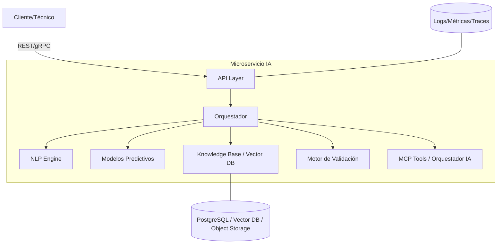

## Arquitectura del Microservicio de IA

### Objetivo
Proveer diagnósticos asistidos por IA para equipos técnicos, con recomendaciones de repuestos y pasos de diagnóstico/reparación, validación de formularios y feedback de coherencia. El microservicio es independiente del core y expone API REST (y opcionalmente gRPC).

### Alcance
- **Input**:
  - **Datos del cliente**: id, historial de visitas.
  - **Datos del equipo**: marca, modelo, fecha de instalación, historial de fallas.
  - **Descripción del problema**: texto libre del cliente/técnico.
  - **Datos del técnico**: experiencia, visitas previas.
- **Output**:
  - **Fallas probables** con % de confianza.
  - **Repuestos y herramientas sugeridos**.
  - **Pasos recomendados** de diagnóstico/reparación.
  - **Validación/corrección** del formulario.
  - (Opcional) **Feedback de coherencia** de la información.

### Estándar de Respuesta API
Todas las respuestas deben incluir `traceId`, `code`, `message` y `data`.

```json
{
  "traceId": "<uuid>",
  "code": "OK",
  "message": "Predicción generada",
  "data": { /* carga útil específica del endpoint */ }
}
```

### Vista de Alto Nivel
- **Capa de API**: FastAPI (REST). gRPC opcional para baja latencia/streaming.
- **Orquestador de Flujos**: coordina NLP, modelos, reglas y MCPs.
- **NLP Engine**: limpieza/normalización, extracción de entidades, embeddings.
- **Modelos Predictivos**: modelos entrenados con histórico (Scikit-learn / PyTorch / Transformers).
- **Knowledge Base Técnica**: búsqueda semántica en manuales y KB; reglas fijas.
- **Motor de Validación**: reglas y verificaciones cruzadas del formulario.
- **MCP/Tools**: integración con servidores MCP y orquestadores (LangChain/LlamaIndex) para herramientas externas.
- **Observabilidad**: logging estructurado, métricas y trazas con propagación de `traceId`.



### Componentes Internos
- **API Layer**
  - Framework: FastAPI.
  - Versionado: `/api/v1`.
  - Contratos: Pydantic para validaciones a nivel de request/response.
  - Esquema de error consistente con `traceId`, `code`, `message`.

- **NLP Engine**
  - Normalización de texto (idioma/español), detección de idioma.
  - Extracción de entidades: marca, modelo, fechas, síntomas.
  - Embeddings para recuperación semántica (SBERT/Instructor/otros).

- **Modelos Predictivos**
  - Entrada: features de equipo, historial, texto procesado.
  - Salida: top-N fallas con `confidence` y `rationale` opcional.
  - Versionado de modelos (MLflow/semver) y artefactos en storage.

- **Knowledge Base Técnica**
  - Ingesta de manuales y reglas de fabricante.
  - Vector DB (pgvector/FAISS/Chroma) para RAG.
  - Reglas determinísticas para repuestos crónicos.

- **Motor de Validación**
  - Reglas de negocio y consistencia (ej. rango de fechas, compatibilidad marca/modelo, duplicados).
  - Sugerencias de corrección de campos.

- **MCP / Orquestación IA**
  - Uso de MCP para herramientas externas (buscadores, KB corporativa, ticketing).
  - Orquestadores (LangChain/LlamaIndex) para flujos multi-paso y razonamiento.

- **Observabilidad y Mantenimiento**
  - Logging estructurado (JSON), métricas (Prometheus), tracing (OpenTelemetry).
  - Health checks, readiness/liveness probes.

### Almacenamiento de Datos Complementario
- **Historial de fallas**: actualización continua para re-entrenamiento.
- **Feedback de técnicos**: señal de refuerzo para ajustar modelos.
- **Diccionario de términos técnicos**: normalización/estandarización.

### Seguridad
- Autenticación/Autorización (API Key/JWT, scopes por endpoint).
- Sanitización de entradas, protección ante prompt injection en pipelines de LLM.
- Cifrado en tránsito (TLS) y en reposo (según almacén).

### Despliegue
- Contenedor: Docker con Python 3.11.
- Configuración: 12-Factor (variables de entorno), `X-Trace-Id` aceptado y propagado.
- Horizontal scaling y stateless API; almacenamiento externo gestionado.

### Endpoints (borrador)
- `POST /predict-fallas` → diagnóstico y repuestos.
- `POST /soporte-tecnico` → pasos de diagnóstico/reparación.
- `POST /validar-formulario` → validación + correcciones sugeridas.

Detalles de contratos y ejemplos en `docs/api.md` y `docs/datos.md`.

### Roadmap propuesto (documentación y MVP)
1) Definir contratos de datos y endpoints.
2) Especificar integración MCP/orquestadores y herramientas.
3) Prototipo MVP con FastAPI + reglas + baseline de embeddings.
4) Iteración con feedback real y registro de calidad.


