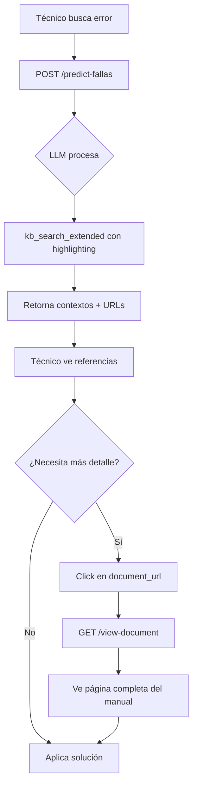

# 📘 Guía de Usuario: Sistema de Búsqueda de Errores Mejorado

**FixeatAI - Sistema de Diagnóstico Técnico**  
**Versión:** 2.0  
**Fecha:** Diciembre 2025

---

## 🎯 Introducción

El Sistema de Búsqueda de Errores Mejorado proporciona referencias detalladas, verificables y navegables a manuales técnicos para diagnóstico de equipos industriales.

### Mejoras Principales

| Característica | Antes | Ahora | Beneficio |
|----------------|-------|-------|-----------|
| **Contexto** | ~500 chars | ~1200 chars | +140% más información |
| **Referencias** | Doc ID genérico | URL + página específica | Clic directo al manual |
| **Términos** | Sin resaltar | Highlighting automático | Identificación rápida |
| **Calidad** | Sin métricas | Score de relevancia | Confiabilidad medible |

---

## 🚀 Guía Rápida

### Para Técnicos

**1. Búsqueda de Error**
```bash
# Endpoint mejorado
POST /api/v1/predict-fallas
```

**Respuesta incluye:**
- ✅ Diagnóstico con fuentes verificables
- ✅ Contexto ampliado (~1200 caracteres)
- ✅ **URL navegable** al manual
- ✅ **Página exacta** del error
- ✅ Términos clave resaltados

**2. Ver Referencia Completa**
```bash
# Hacer clic en document_url o usar:
GET /view-document/{doc_id}?page=23
```

---

## 📋 Ejemplos de Uso

### Ejemplo 1: Diagnóstico de Error

**Request:**
```json
POST http://localhost:8000/api/v1/predict-fallas
{
  "descripcion_problema": "error E55 ventilador no funciona",
  "equipo": {
    "marca": "RATIONAL",
    "modelo": "ICOMBI PRO",
    "categoria": "camara"
  },
  "cliente": {"nombre": "Cliente Test", "rut": "12345678-9"},
  "tecnico": {"nombre": "Técnico Test", "rut": "98765432-1"}
}
```

**Response (simplificada):**
```json
{
  "data": {
    "fallas_probables": [
      {
        "falla": "Error en motor del ventilador",
        "confidence": 0.95,
        "rationale": "El ventilador no alcanza revoluciones [source:manual.pdf#c17]",
        "repuestos_sugeridos": ["motor ventilador", "sensor temperatura"],
        "pasos": [
          {"orden": 1, "descripcion": "Desconectar alimentación", "tipo": "seguridad"},
          {"orden": 2, "descripcion": "Verificar bloqueos en turbina", "tipo": "diagnostico"}
        ]
      }
    ],
    "contextos": [
      {
        "fuente": "manual_rational_icombi.pdf#c17",
        "score": 0.95,
        "contexto": "Error S_55: El **motor** del **ventilador** no alcanza las revoluciones especificadas...",
        "document_url": "https://s3.../manual.pdf#page=23",  // ⭐ CLICK AQUÍ
        "metadata": {
          "page": 23,  // ⭐ PÁGINA EXACTA
          "brand": "RATIONAL",
          "model": "ICOMBI PRO"
        }
      }
    ]
  }
}
```

### Ejemplo 2: Visualizar Documento

**Request:**
```http
GET http://localhost:7070/view-document/manual_rational_page_23
```

**Response:**
```json
{
  "available": true,
  "text": "Texto completo de la página 23...",
  "source_url": "https://s3.../manual.pdf#page=23",
  "page": 23,
  "metadata": {...}
}
```

---

## 🔧 API Reference

### Endpoint Principal: `/api/v1/predict-fallas`

**Mejoras:**
- ✅ Campo `contextos` con información ampliada
- ✅ Campo `document_url` para navegación directa
- ✅ Campo `context_highlighted` con términos resaltados
- ✅ Metadata enriquecida con `page`

**Estructura de Respuesta:**
```typescript
interface PredictFallasResponse {
  traceId: string;
  code: "OK";
  message: string;
  data: {
    fallas_probables: Falla[];
    fuentes: string[];  // IDs de documentos
    contextos: Contexto[];  // ⭐ NUEVO
    quality_metrics: QualityMetrics;
    signals: SearchSignals;
  };
}

interface Contexto {
  fuente: string;  // Doc ID con chunk
  score: number;  // Relevancia (0-1)
  contexto: string;  // ~1200 caracteres
  document_url: string;  // ⭐ URL navegable
  metadata: {
    page?: number;  // ⭐ Número de página
    source: string;  // URL/path original
    brand: string;
    model: string;
  };
}
```

### Endpoint Extendido: `/tools/kb_search_extended`

**Parámetros:**
```json
{
  "query": "error ventilador",
  "top_k": 5,
  "context_chars": 2000,
  "highlight_terms": true  // ⭐ NUEVO
}
```

**Response:**
```json
{
  "hits": [
    {
      "doc_id": "manual.pdf#c17",
      "score": 0.95,
      "context": "texto ampliado...",
      "context_highlighted": "**error** en **ventilador**...",  // ⭐ NUEVO
      "highlighted_terms": ["error", "ventilador"],  // ⭐ NUEVO
      "document_url": "https://s3.../manual.pdf#page=23",  // ⭐ NUEVO
      "metadata": {
        "page": 23,  // ⭐ NUEVO
        "match_position": 1234,
        "context_start": 1000,
        "context_end": 2200
      }
    }
  ]
}
```

### Endpoint de Visualización: `/view-document/{doc_id}`

**Request:**
```http
GET /view-document/manual_rational_page_23?page=25
```

**Response:**
```json
{
  "available": true,
  "doc_id": "manual_rational_page_23",
  "text": "Texto completo del documento...",
  "source_url": "https://s3.../manual.pdf#page=23",
  "page": 23,
  "text_length": 1543
}
```

---

## 📥 Ingesta de Documentos

### Opción 1: Documento Completo (Legacy)

```bash
python ingestar_pdfs.py manual.pdf
```

### Opción 2: Por Páginas (Recomendado) ⭐

```bash
python ingestar_pdfs.py --by-page manual.pdf
```

**Ventajas del modo `--by-page`:**
- ✅ Cada página es un documento independiente
- ✅ Metadata `page` automática
- ✅ Referencias más precisas
- ✅ Ideal para manuales largos (150+ páginas)

### Opción 3: Re-procesamiento con Chunking Semántico

```bash
# Análisis (sin cambios)
python reprocesar_documentos.py --dry-run

# Aplicar cambios
python reprocesar_documentos.py --backup --apply
```

**Beneficios:**
- ✅ Detección automática de códigos de error
- ✅ Respeta límites de procedimientos
- ✅ Chunks semánticamente coherentes
- ✅ Mejora relevancia de búsquedas

---

## 📊 Métricas de Calidad

### Ver Métricas de una Búsqueda

```python
from services.kb.quality_metrics import evaluate_search_quality

metrics = evaluate_search_quality(
    query="error ventilador",
    results=search_results,
    print_report=True
)

print(f"Score global: {metrics.overall_quality_score:.1f}/100")
```

**Output:**
```
============================================================
REPORTE DE CALIDAD DE BÚSQUEDA
============================================================

📊 SCORE GLOBAL: 85.3/100

📍 RELEVANCIA:
  Precision@K: 100%
  Recall:      80%
  F1 Score:    89%

📝 CONTEXTOS:
  Longitud promedio: 1245 chars
  Coverage términos: 100%

🔗 REFERENCIAS:
  Total referencias: 5
  Con página:        5 (100%)
  Con URL:           5 (100%)

⚡ PERFORMANCE:
  Latencia: 87.3ms
  Documentos buscados: 5
============================================================
```

---

## 🎨 Highlighting de Términos

Los términos clave se resaltan automáticamente usando `**término**` (Markdown bold).

**Ejemplo:**
```
Input: "error ventilador motor"

Output: "**Error** S_55: El **motor** del **ventilador** no alcanza revoluciones..."
```

### Desactivar Highlighting

```json
POST /tools/kb_search_extended
{
  "query": "error ventilador",
  "highlight_terms": false  // Desactivar
}
```

---

## 🔄 Flujo Completo



---

## 🛠️ Troubleshooting

### Problema: No aparecen números de página

**Causa:** Documentos ingresados antes de implementar `--by-page`

**Solución:**
```bash
# Re-ingestar con modo por páginas
python ingestar_pdfs.py --by-page manual.pdf

# O re-procesar existentes
python reprocesar_documentos.py --apply
```

### Problema: URLs no funcionan

**Causa:** Documento es local (no URL S3/HTTP)

**Solución:**
- URLs S3/HTTP funcionan directamente
- Rutas locales usan `/view-document/{doc_id}`

### Problema: Contextos muy cortos

**Causa:** Configuración de `context_chars` muy baja

**Solución:**
```json
{
  "context_chars": 2000  // Aumentar (default: 2000)
}
```

---

## 📈 Mejores Prácticas

### Para Administradores

1. **Ingestar documentos con `--by-page`** para mejor granularidad
2. **Re-procesar documentos legacy** con chunking semántico
3. **Monitorear métricas de calidad** regularmente
4. **Mantener backups** antes de re-procesar

### Para Técnicos

1. **Revisar score de relevancia** en cada contexto
2. **Hacer clic en document_url** para ver contexto completo
3. **Verificar número de página** antes de buscar en manual físico
4. **Reportar referencias incorrectas** para mejorar el sistema

### Para Desarrolladores

1. **Usar kb_search_extended** en lugar de kb_search
2. **Incluir highlight_terms=True** para mejor UX
3. **Calcular métricas** en cada búsqueda importante
4. **Cachear resultados** cuando sea apropiado

---

## 📞 Soporte

**Documentación técnica:** `docs/IMPLEMENTACION-BUSQUEDA-ERRORES.md`  
**Arquitectura:** `docs/arquitectura.md`  
**Changelog:** Ver sección de logs en implementación

**Versión del sistema:** 2.0  
**Última actualización:** Diciembre 2025

---

## 🎓 Glosario

- **Chunk**: Fragmento de documento (típicamente ~1200 caracteres)
- **Contexto**: Ventana de texto alrededor del match
- **doc_id**: Identificador único de documento/chunk
- **Highlighting**: Resaltado de términos clave
- **Hit**: Resultado de búsqueda
- **Score**: Métrica de relevancia (0-1, menor es mejor)
- **Semantic Chunking**: División inteligente respetando contenido

---

## ✅ Checklist de Implementación

- [x] FASE 1: Contextos ampliados (1200+ chars)
- [x] FASE 2: Referencias navegables (URLs + páginas)
- [x] FASE 3: Optimizaciones (chunking + highlighting + métricas)
- [x] Tests de integración end-to-end
- [x] Documentación completa
- [x] Scripts de mantenimiento (reprocesamiento)
- [x] Retrocompatibilidad con API legacy

🎉 **Sistema listo para producción**


