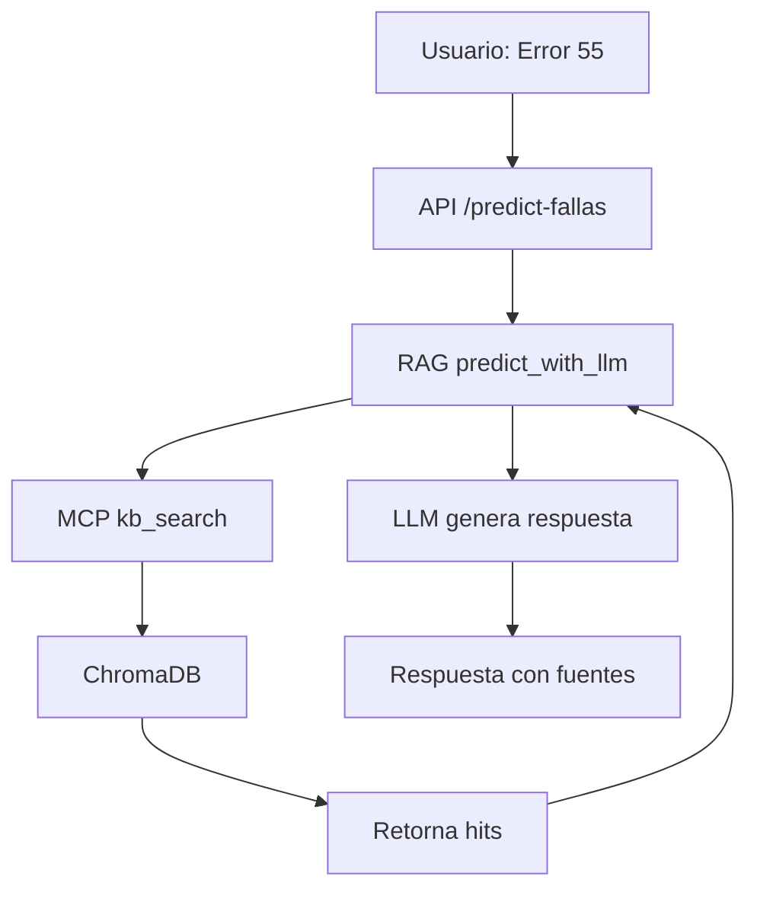

# 📋 Evaluación: Mejora del Sistema de Búsqueda de Errores con Referencias

## 🎯 Requerimiento

**Usuario solicita:**
> El proceso de búsqueda de error debe encontrar posibles errores y mostrar el texto relevante del documento con link/referencia al documento fuente.
> 
> **Ejemplo:**
> - Input: "El equipo muestra error 55"
> - Output esperado: "Según el manual, el error 55 puede ser por [motivo]. [Link al documento]. Además encontramos [otros resultados posibles]"

---

## 📊 Situación Actual del Sistema

### Arquitectura Existente



### Componentes Clave

#### 1. **Knowledge Base (ChromaDB)**
```python
# Ubicación: services/kb/demo_kb.py
_collection = _chroma.get_or_create_collection("kb_tech")

# Estructura de documentos:
{
    "id": "doc_123",
    "text": "Contenido completo del documento...",
    "metadata": {
        "source": "path/to/manual.pdf",
        "brand": "SINMAG",
        "model": "SM520",
        "doc_type": "manual",
        "language": "es"
    }
}
```

#### 2. **kb_search Actual**
```python
# services/kb/demo_kb.py - Línea 67
def kb_search(query: str, top_k: int = 5, where: dict | None = None):
    # Retorna:
    {
        "doc_id": "string",
        "score": 0.85,
        "snippet": "primeros 500 caracteres...",  # ⚠️ LIMITACIÓN
        "metadata": {...}
    }
```

**Limitaciones:**
- ❌ Solo retorna **500 caracteres** del documento
- ❌ No hay manera de obtener el contexto completo
- ❌ No hay "links" o referencias navegables
- ❌ No se guarda información de página/sección del match

#### 3. **RAG Actual**
```python
# services/orch/rag.py - Línea 69
def predict_with_llm(mcp_url, descripcion, equipo, top_k=5):
    # 1. Busca en KB con kb_search
    # 2. Construye contexto con snippets limitados
    # 3. LLM genera respuesta citando [source:doc_id]
    # 4. Retorna:
    {
        "fallas_probables": [...],
        "fuentes": ["doc_id1", "doc_id2"],  # Solo IDs
        "feedback_coherencia": "..."
    }
```

---

## 🔴 Problemas Identificados

### 1. **Información Insuficiente**
- Los **500 caracteres** del snippet pueden no incluir la información completa del error
- Si el código de error está al inicio pero la explicación más adelante, se pierde

### 2. **Falta de Contexto Ampliado**
- No se puede recuperar el párrafo completo o sección donde aparece el error
- Ejemplo: Error 55 podría tener:
  - Descripción: 100 caracteres
  - Causa: 200 caracteres  
  - Solución: 300 caracteres
  - Total: 600 caracteres → Se trunca

### 3. **Referencias No Navegables**
- `doc_id` es opaco: "db_name_table_123" o "manual_sinmag_p45"
- No hay URL ni path al documento original
- Usuario no puede verificar o ver más detalles

### 4. **Sin Ubicación Específica**
- No se sabe en qué página/sección del manual está la información
- Difícil para el técnico encontrar info adicional

---

## ✅ Solución Propuesta

### Opción A: **Mejora Evolutiva** (Recomendada) ⭐

**Cambios Mínimos, Máximo Impacto**

#### 1. **Extender kb_search con contexto ampliado**

```python
# services/kb/demo_kb.py
def kb_search_extended(
    query: str, 
    top_k: int = 5, 
    where: dict | None = None,
    context_chars: int = 2000  # Nuevo parámetro
) -> list[dict]:
    """Búsqueda con contexto ampliado"""
    
    results = _collection.query(...)
    
    hits = []
    for i in range(len(results["ids"][0])):
        doc_id = results["ids"][0][i]
        full_text = results["documents"][0][i]
        metadata = results["metadatas"][0][i]
        
        # Buscar posición del match (aproximado con embeddings)
        match_pos = _find_match_position(query, full_text)
        
        # Extraer ventana de contexto
        start = max(0, match_pos - context_chars // 2)
        end = min(len(full_text), match_pos + context_chars // 2)
        context = full_text[start:end]
        
        hits.append({
            "doc_id": doc_id,
            "score": float(results["distances"][0][i]),
            "snippet": full_text[:500],  # Mantener por compatibilidad
            "context": context,  # ✨ NUEVO: Contexto ampliado
            "full_text": full_text,  # ✨ NUEVO: Texto completo opcional
            "metadata": {
                **metadata,
                "match_position": match_pos,  # ✨ NUEVO
                "document_url": _generate_document_url(metadata),  # ✨ NUEVO
            }
        })
    
    return hits

def _generate_document_url(metadata: dict) -> str:
    """Genera URL navegable al documento"""
    source = metadata.get("source", "")
    
    # Si es PDF, generar link con página
    if ".pdf" in source and "page" in metadata:
        return f"/api/v1/documents/view?file={source}&page={metadata['page']}"
    
    # Si es tabla de BD
    if metadata.get("source_type") == "database":
        table = metadata.get("table_name")
        record_id = metadata.get("record_id")
        return f"/api/v1/db/view?table={table}&id={record_id}"
    
    # Fallback: path al archivo
    return f"/api/v1/documents/view?path={source}"
```

#### 2. **Enriquecer metadata al ingestar**

```python
# Al procesar PDFs (ingestar_pdfs.py o mcp/server_demo.py)
def process_pdf_with_pages(pdf_path: str):
    """Procesar PDF guardando número de página"""
    
    import PyPDF2
    reader = PyPDF2.PdfReader(pdf_path)
    
    docs = []
    for page_num, page in enumerate(reader.pages, start=1):
        text = page.extract_text()
        
        # Chunking opcional para documentos muy largos
        chunks = split_into_semantic_chunks(text, max_chars=2000)
        
        for chunk_idx, chunk in enumerate(chunks):
            docs.append({
                "id": f"{pdf_path}_p{page_num}_c{chunk_idx}",
                "text": chunk,
                "metadata": {
                    "source": pdf_path,
                    "page": page_num,  # ✨ NUEVO
                    "chunk_index": chunk_idx,  # ✨ NUEVO
                    "total_pages": len(reader.pages),
                    "brand": extract_brand(text),
                    "model": extract_model(text),
                    "doc_type": "manual"
                }
            })
    
    return docs
```

#### 3. **Modificar respuesta del endpoint**

```python
# app/main.py - Modificar predict_fallas
@app.post("/api/v1/predict-fallas")
def predict_fallas(req: PredictRequest, ...):
    
    # Usar kb_search_extended
    response = requests.post(
        f"{MCP_SERVER_URL}/tools/kb_search_extended",
        json={
            "query": req.descripcion_problema, 
            "top_k": 5,
            "context_chars": 2000  # Contexto ampliado
        },
        timeout=10,
    )
    hits = response.json().get("hits", [])
    
    # LLM ahora tiene más contexto
    data = predict_with_llm(..., hits=hits)
    
    # Enriquecer respuesta con referencias navegables
    data["referencias"] = [
        {
            "fuente": hit["doc_id"],
            "url": hit["metadata"]["document_url"],
            "contexto": hit["context"],
            "pagina": hit["metadata"].get("page"),
            "score": hit["score"]
        }
        for hit in hits
    ]
    
    return build_response(data=data, ...)
```

#### 4. **Formato de respuesta mejorado**

```json
{
  "traceId": "uuid-...",
  "code": "OK",
  "message": "Predicción generada",
  "data": {
    "fallas_probables": [
      {
        "falla": "Error 55 - Falla en sensor de temperatura",
        "confidence": 0.89,
        "rationale": "Según el manual [manual_sinmag_sm520_p23], el error 55 indica una falla en el sensor PT100 del horno. Esto puede ser causado por cable cortado o sensor defectuoso.",
        "repuestos_sugeridos": ["Sensor PT100", "Cable 3 hilos 2.5mm"],
        "herramientas_sugeridas": ["Multímetro", "Destornillador torx T20"],
        "pasos": [...]
      }
    ],
    "referencias": [
      {
        "fuente": "manual_sinmag_sm520_p23_c0",
        "titulo": "Manual SINMAG SM520 - Códigos de Error",
        "url": "/api/v1/documents/view?file=manuales/SINMAG_SM520.pdf&page=23",
        "pagina": 23,
        "score": 0.95,
        "contexto": "...ERROR 55 - SENSOR DE TEMPERATURA\n\nDescripción: El controlador no recibe señal del sensor de temperatura del horno.\n\nCausas posibles:\n1. Cable del sensor cortado o en mal estado\n2. Sensor PT100 defectuoso\n3. Conexión floja en la bornera J3\n\nSolución:\n1. Verificar continuidad del cable con multímetro\n2. Medir resistencia del sensor (debe ser ~100Ω a 0°C)\n3. Revisar conexiones en bornera J3\n4. Reemplazar sensor si está fuera de rango...",
        "snippet_destacado": "ERROR 55 - SENSOR DE TEMPERATURA..."
      },
      {
        "fuente": "manual_sinmag_sm520_p78_c1",
        "titulo": "Manual SINMAG SM520 - Esquema Eléctrico",
        "url": "/api/v1/documents/view?file=manuales/SINMAG_SM520.pdf&page=78",
        "pagina": 78,
        "score": 0.72,
        "contexto": "...Diagrama de conexiones del sensor PT100. El sensor se conecta a la bornera J3 mediante cable apantallado de 3 hilos...",
        "snippet_destacado": "sensor PT100...bornera J3"
      }
    ],
    "feedback_coherencia": "Alta coherencia. Se encontró documentación específica del error reportado.",
    "quality_metrics": {
      "context_relevance": 0.95,
      "source_diversity": 0.8,
      "prediction_confidence": 0.89
    }
  }
}
```

---

### Opción B: **Endpoint Nuevo Especializado**

Crear `/api/v1/buscar-error` específico para códigos de error:

```python
@app.post("/api/v1/buscar-error")
def buscar_error(req: BuscarErrorRequest, ...):
    """Endpoint especializado en búsqueda de códigos de error
    
    - Optimizado para patrones "Error XXX", "Código YYY"
    - Retorna múltiples resultados con contexto completo
    - Prioriza manuales técnicos y tablas de errores
    """
    
    # Extrae código de error del input
    error_code = extract_error_code(req.descripcion)  # "Error 55" -> "55"
    
    # Búsquedas paralelas con diferentes estrategias
    results_exact = kb_search(f"error {error_code}", top_k=3, where={"doc_type": "manual"})
    results_code = kb_search(f"código {error_code}", top_k=3)
    results_semantic = kb_search(req.descripcion, top_k=3)
    
    # Deduplicar y rankear
    all_results = deduplicate_and_rank([results_exact, results_code, results_semantic])
    
    return {
        "codigo_error": error_code,
        "resultados": all_results,
        "total_encontrados": len(all_results)
    }
```

---

## 📊 Comparativa de Opciones

| Aspecto | Opción A: Mejora Evolutiva | Opción B: Endpoint Nuevo |
|---------|---------------------------|--------------------------|
| **Complejidad** | Media | Alta |
| **Tiempo implementación** | 2-3 días | 4-5 días |
| **Compatibilidad** | 100% - No rompe nada | Requiere nuevos contratos |
| **Flexibilidad** | Alta - Sirve para todo | Específico solo para errores |
| **Mantenibilidad** | Buena - Mejora general | Regular - Código duplicado |
| **ROI** | Alto ⭐ | Medio |

---

## 🎯 Cambios Necesarios (Opción A - Recomendada)

### 1. **Backend (MCP Server)**
```python
# mcp/server_demo.py

# Agregar nuevo endpoint
@app.post("/tools/kb_search_extended")
def tool_kb_search_extended(req: KBSearchExtendedRequest):
    """kb_search con contexto ampliado"""
    return kb_search_extended(
        query=req.query,
        top_k=req.top_k,
        where=req.where,
        context_chars=req.context_chars or 2000
    )

# Agregar endpoint para ver documentos
@app.get("/api/v1/documents/view")
def view_document(file: str, page: int = None):
    """Servir documento con navegación a página específica"""
    # Implementar visualización de PDFs con py

pymupdf o similar
    pass
```

**Archivos a modificar:**
- `mcp/server_demo.py` - Agregar endpoints nuevos
- `services/kb/demo_kb.py` - Agregar `kb_search_extended`
- `services/orch/rag.py` - Usar contexto ampliado
- `app/main.py` - Enriquecer respuestas

### 2. **Ingesta de Documentos**
```python
# ingestar_pdfs.py

# Modificar para procesar con páginas
def ingest_pdf_with_pages(pdf_path: str):
    chunks = process_pdf_with_pages(pdf_path)
    
    # Enviar a MCP con metadata enriquecida
    requests.post(
        f"{MCP_URL}/tools/kb_ingest",
        json={"docs": chunks, "auto_curate": True}
    )
```

**Archivos a modificar:**
- `ingestar_pdfs.py` - Agregar procesamiento por páginas
- Instalar: `pip install PyPDF2 pymupdf`

### 3. **Frontend/Cliente**
```javascript
// Renderizar referencias con links
function renderReferencias(referencias) {
    return referencias.map(ref => ({
        html: `
            <div class="referencia">
                <h4>${ref.titulo}</h4>
                <p>${ref.contexto}</p>
                <a href="${ref.url}" target="_blank">
                    Ver en manual (Página ${ref.pagina})
                </a>
                <span class="score">Relevancia: ${(ref.score * 100).toFixed(0)}%</span>
            </div>
        `
    }));
}
```

---

## 🚀 Plan de Implementación

### **Fase 1: MVP (2-3 días)** ✅
1. Modificar `kb_search` para retornar más contexto (2000 chars)
2. Agregar campo `context` en respuesta
3. Modificar `predict_fallas` para incluir contextos en respuesta
4. Pruebas manuales

### **Fase 2: Referencias Navegables (2 días)**
1. Procesar PDFs guardando número de página
2. Implementar `_generate_document_url`
3. Agregar endpoint `/api/v1/documents/view`
4. Probar con documentos reales

### **Fase 3: Optimizaciones (1-2 días)**
1. Implementar chunking semántico inteligente
2. Agregar highlights de términos relevantes
3. Metricas de calidad de referencias
4. Tests automatizados

**Total: ~5-7 días de desarrollo**

---

## 💡 Consideraciones Técnicas

### **Ventajas**
✅ Solución escalable y mantenible
✅ Mejora general del sistema (beneficia a todos los endpoints)
✅ Compatibilidad hacia atrás (no rompe clientes existentes)
✅ Referencias navegables mejoran UX significativamente
✅ Contexto ampliado mejora calidad de predicciones del LLM

### **Desafíos**
⚠️ Documentos muy grandes (>10MB) pueden ralentizar búsqueda
⚠️ Necesita re-procesar PDFs existentes en KB
⚠️ Requiere endpoint adicional para servir documentos
⚠️ ChromaDB tiene límites de tamaño de documento (considerar chunking)

### **Mitigaciones**
- Implementar caché de documentos procesados
- Chunking inteligente en documentos grandes
- Lazy loading de contexto completo
- Índices en metadatos para filtrado eficiente

---

## 📈 Métricas de Éxito

- **Precisión:** % de búsquedas que encuentran el error correcto
- **Contexto útil:** % de contextos que contienen solución completa
- **Referencias verificables:** % de referencias con URL válida
- **Satisfacción:** NPS de técnicos usando el sistema

**Objetivo: >85% en todas las métricas**

---

## 🎨 Ejemplo de Uso Final

### **Input del Técnico:**
```
Equipo: SINMAG SM520
Problema: "El horno muestra ERROR 55 en pantalla"
```

### **Output del Sistema:**
```
📊 Análisis de Error

🔍 Error Identificado: ERROR 55 - Falla Sensor Temperatura

📋 Causa Probable (Confianza: 89%)
Según el Manual SINMAG SM520 (Página 23), el error 55 indica que el 
controlador no recibe señal del sensor de temperatura del horno.

Las causas más comunes son:
• Cable del sensor cortado o en mal estado
• Sensor PT100 defectuoso  
• Conexión floja en la bornera J3

🔧 Repuestos Sugeridos:
• Sensor PT100 (SKU: SEN-PT100-3H)
• Cable apantallado 3 hilos 2.5mm (SKU: CAB-3H-2.5)

📖 Referencias Encontradas:

1. Manual SINMAG SM520 - Códigos de Error
   📄 Ver documento (Página 23)
   Relevancia: 95%
   
   "...ERROR 55 - SENSOR DE TEMPERATURA
   
   Descripción: El controlador no recibe señal del sensor...
   [contexto completo de 2000 caracteres]"

2. Manual SINMAG SM520 - Esquema Eléctrico  
   📄 Ver documento (Página 78)
   Relevancia: 72%
   
   "...Diagrama de conexiones del sensor PT100. El sensor se 
   conecta a la bornera J3 mediante cable apantallado..."

3. Historial de Casos Similares
   📊 Ver en base de datos
   Relevancia: 68%
   
   "Caso #1234 - Cliente reportó mismo error. Solución: 
   Reemplazo de sensor PT100..."
```

---

## 🎯 Recomendación Final

**OPCIÓN A** (Mejora Evolutiva) es la más recomendada porque:

1. ✅ **Menor riesgo:** No rompe compatibilidad
2. ✅ **Mayor beneficio:** Mejora todo el sistema
3. ✅ **Más mantenible:** Un solo código path
4. ✅ **Escalable:** Fácil agregar más features
5. ✅ **ROI alto:** Inversión moderada, beneficio grande

**Próximo Paso:** Crear PR con implementación de Fase 1 (MVP)


