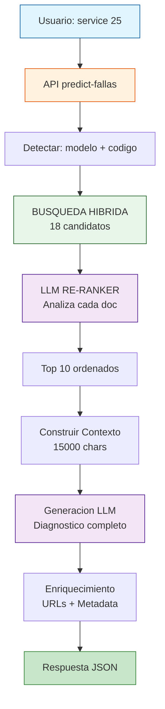

# Flujo del Predictor de Fallas (Versión Simple)

## Diagrama Principal (SIN EMOJIS - Compatible con todas las herramientas)

```mermaid
flowchart TD
    Start([Usuario hace consulta]) --> Input[POST /api/v1/predict-fallas]
    
    Input --> Parse{Parsear Request}
    Parse -->|Extraer datos| DataExtract[Extraer datos<br/>descripcion, equipo, cliente]
    
    DataExtract --> CheckLLM{USE_LLM?}
    
    CheckLLM -->|true| DetectModel[Detectar Modelo<br/>ej: iCombi Classic]
    
    DetectModel --> DetectError[Detectar Código Error<br/>ej: service 25]
    
    DetectError --> HybridSearch[BUSQUEDA HIBRIDA<br/>kb_search_hybrid]
    
    HybridSearch --> Semantic[Busqueda Semantica<br/>Embeddings: 40%]
    HybridSearch --> Keyword[Busqueda Keywords<br/>BM25-like: 60%]
    
    Semantic --> Combine[Combinar Scores]
    Keyword --> Combine
    
    Combine --> Boost{Modelo detectado?}
    Boost -->|Si: iCombi Classic| ApplyBoost[Boost 1.5x a documentos<br/>del modelo]
    Boost -->|No| NormalScore[Mantener scores<br/>originales]
    
    ApplyBoost --> Candidates[Candidatos: 15-20 docs]
    NormalScore --> Candidates
    
    Candidates --> LLMReranker[LLM RE-RANKER<br/>llm_reranker.py]
    
    LLMReranker --> AnalyzeContext[LLM Analiza cada doc<br/>Query + Contenido + Contexto]
    
    AnalyzeContext --> LLMScore[LLM Asigna<br/>Relevancia 0-100<br/>Explicacion]
    
    LLMScore --> LLMSort[Ordenar por<br/>relevancia LLM]
    
    LLMSort --> Top10[Top 10 documentos<br/>mas relevantes]
    
    Top10 --> BuildContext[Construir Contexto<br/>Expandido 2000+ chars]
    
    BuildContext --> LLMPrompt[Crear Prompt LLM]
    
    LLMPrompt --> LLMCall[Llamar LLM<br/>gpt-4o-mini]
    
    LLMCall --> LLMResponse[LLM Genera Diagnostico<br/>Fallas + Repuestos + Pasos]
    
    LLMResponse --> EnrichContexts[Enriquecer Contextos]
    
    EnrichContexts --> AddMetadata[Agregar Metadata<br/>Relevancia + Explicacion + URLs]
    
    AddMetadata --> Response[Respuesta Final]
    
    CheckLLM -->|false| Heuristic[Analisis Heuristico<br/>infer_from_hits]
    Heuristic --> SimpleSearch[Busqueda Simple<br/>kb_search_extended]
    SimpleSearch --> SimpleResponse[Respuesta Basica]
    SimpleResponse --> Response
    
    Response --> Return([Return JSON])
    
    classDef inputClass fill:#e1f5ff,stroke:#01579b,stroke-width:2px
    classDef processClass fill:#fff3e0,stroke:#e65100,stroke-width:2px
    classDef llmClass fill:#f3e5f5,stroke:#4a148c,stroke-width:2px
    classDef searchClass fill:#e8f5e9,stroke:#1b5e20,stroke-width:2px
    classDef outputClass fill:#c8e6c9,stroke:#2e7d32,stroke-width:3px
    
    class Start,Input,Return inputClass
    class DetectModel,DetectError,BuildContext,EnrichContexts processClass
    class LLMReranker,AnalyzeContext,LLMScore,LLMPrompt,LLMCall,LLMResponse llmClass
    class HybridSearch,Semantic,Keyword,Combine,Candidates searchClass
    class Response,Top10 outputClass
```

## Version ULTRA SIMPLE (para herramientas más básicas)

## Tiempos de Ejecución

| Fase | Tiempo |
|------|--------|
| Busqueda Hibrida | 1-2 seg |
| LLM Re-Ranker | 5-8 seg |
| Construccion Contexto | 200 ms |
| Generacion LLM | 2-3 seg |
| **TOTAL** | **8-14 seg** |
