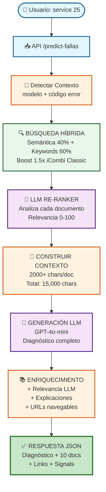

# 🎨 Flujo Visual del Predictor de Fallas

> Este diagrama se renderiza automáticamente en GitHub



## ⏱️ Tiempos de Ejecución

| Fase | Tiempo |
|------|--------|
| Búsqueda Híbrida | 1-2 seg |
| LLM Re-Ranker | 5-8 seg |
| Construcción Contexto | 200 ms |
| Generación LLM | 2-3 seg |
| **TOTAL** | **8-14 seg** |

## 🎯 Flujo Detallado

```
👤 Usuario: "Por qué me arroja un service 25"
    ↓
📥 API recibe petición
    ├─ modelo: "iCombi Classic"
    └─ código: "25"
    ↓
🔍 BÚSQUEDA HÍBRIDA (1-2 seg)
    ├─ Semántica 40%: embeddings vectoriales
    ├─ Keywords 60%: "service", "25", "icombi"
    └─ Boost 1.5x: docs de iCombi Classic
    ➜ 18 documentos candidatos
    ↓
🤖 LLM RE-RANKER (5-8 seg)
    ├─ Analiza cada documento
    ├─ Asigna relevancia 0-100
    └─ Explica por qué es relevante
    ➜ Top 10 ordenados
    ↓
📝 CONSTRUCCIÓN CONTEXTO (200 ms)
    ├─ Expande a 2000+ chars/doc
    └─ Total: ~15,000 caracteres
    ↓
🤖 GENERACIÓN LLM (2-3 seg)
    ├─ Fallas probables
    ├─ Repuestos necesarios
    ├─ Pasos de reparación
    └─ Referencias citadas
    ↓
📚 ENRIQUECIMIENTO (100 ms)
    ├─ Relevancia LLM: 95%
    ├─ Explicación del LLM
    ├─ URL navegable: pdf#page=28
    └─ Metadata completa
    ↓
✅ RESPUESTA JSON
    ├─ Diagnóstico detallado
    ├─ 10 documentos ordenados
    ├─ Links directos a PDFs
    └─ Signals de calidad
```

## 📊 Componentes

### Búsqueda Híbrida 🔍
- **Archivo:** `services/kb/demo_kb.py:537-630`
- **Función:** Combina semántica + keywords
- **Resultado:** 18 candidatos en 1-2 seg

### LLM Re-Ranker 🤖
- **Archivo:** `services/orch/llm_reranker.py`
- **Función:** Análisis semántico profundo
- **Resultado:** Top 10 con explicaciones

### RAG Orquestador 🎨
- **Archivo:** `services/orch/rag.py`
- **Función:** Construye contexto enriquecido
- **Resultado:** Prompt de 15,000 caracteres

### API Principal 📥
- **Archivo:** `app/main.py:83-226`
- **Función:** Endpoint `/predict-fallas`
- **Resultado:** JSON estructurado
