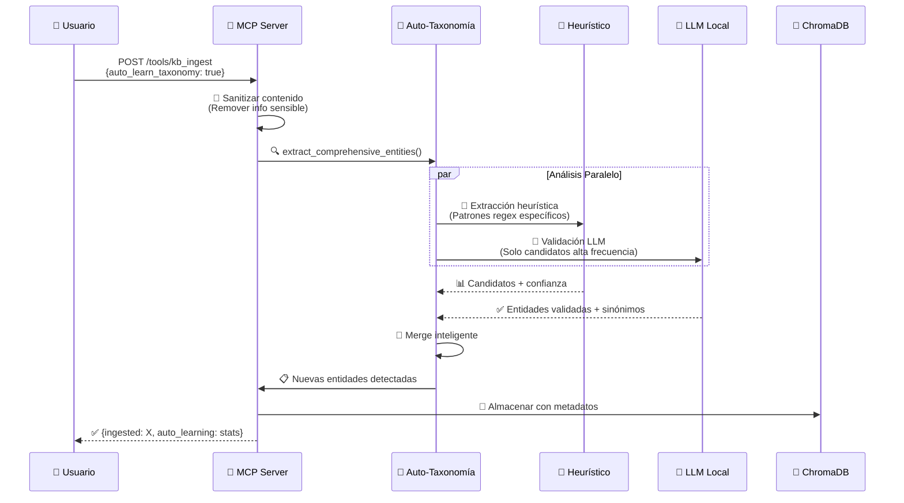
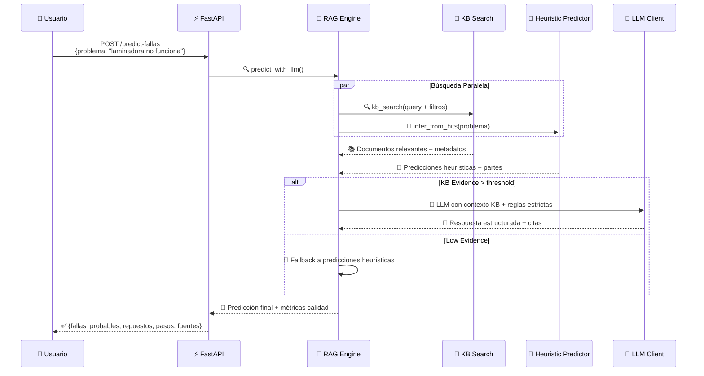
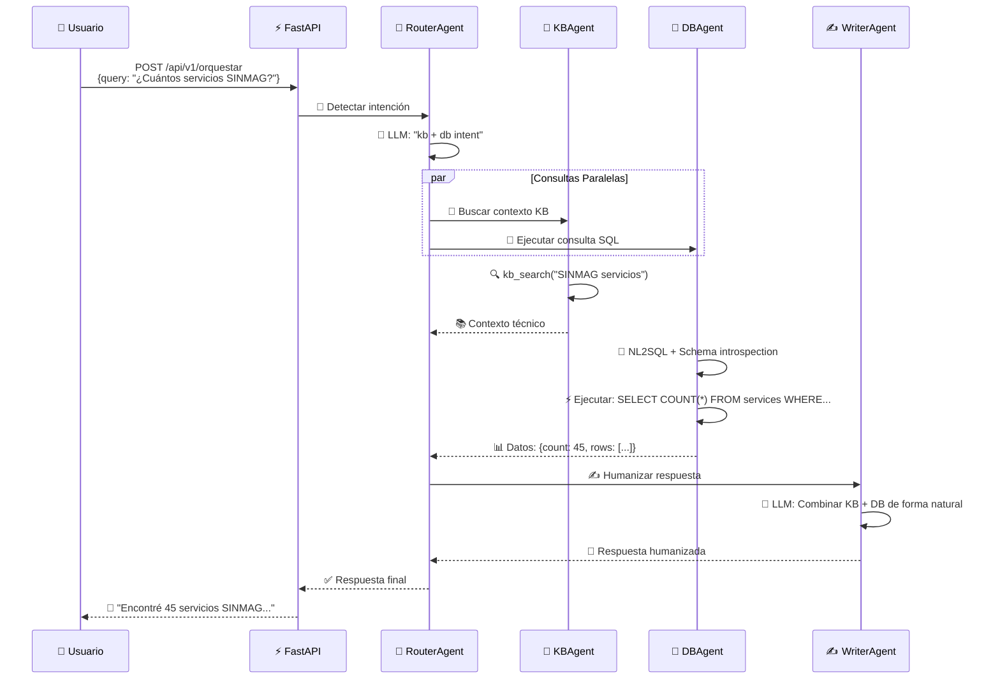
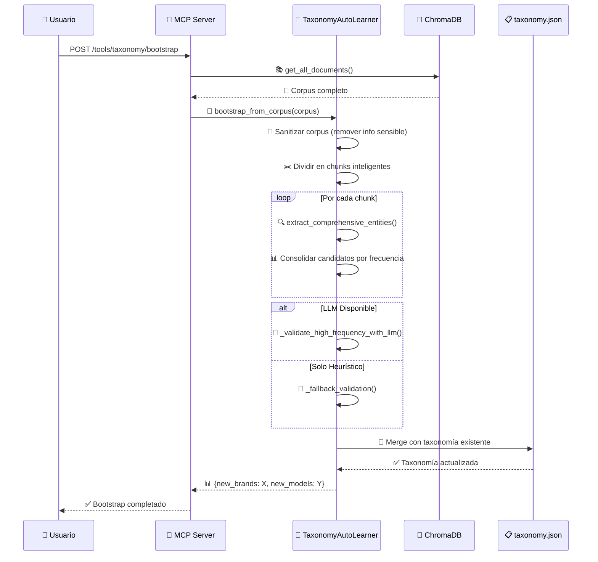

# 🔄 Diagrama de Flujo Completo - FixeatAI

## 🎯 **Arquitectura General del Sistema**

```mermaid
graph TB
    %% === ENTRADA DE DATOS ===
    subgraph "📥 ENTRADA DE DATOS"
        USER[👤 Usuario]
        FILES[📄 Archivos<br/>PDF, DOCX, TXT]
        URLS[🌐 URLs<br/>Documentos Web]
        MYSQL[🗄️ MySQL RDS<br/>Datos Históricos]
    end

    %% === CAPA API ===
    subgraph "🚀 CAPA API - Puerto 8000"
        API[⚡ FastAPI Main<br/>app/main.py]
        
        subgraph "🔍 Endpoints Principales"
            PREDICT[🎯 /predict-fallas]
            QA[❓ /api/v1/qa]
            SUPPORT[🛠️ /soporte-tecnico]
            VALIDATE[✅ /validar-formulario]
            ANALYTICS[📊 /ops-analitica]
            ORCHESTRATE[🎭 /orquestar]
        end
    end

    %% === MCP SERVER ===
    subgraph "🔧 MCP SERVER - Puerto 7070"
        MCP[🛠️ MCP Demo Server<br/>mcp/server_demo.py]
        
        subgraph "🔨 Tools MCP"
            KB_SEARCH[🔍 kb_search]
            KB_INGEST[📥 kb_ingest]
            KB_CURATE[🔄 kb_curate]
            TAX_GET[📋 taxonomy]
            TAX_BOOTSTRAP[🚀 taxonomy/bootstrap]
            TAX_STATS[📊 taxonomy/stats]
            DB_QUERY[💾 db_query]
        end
    end

    %% === KNOWLEDGE BASE ===
    subgraph "🧠 KNOWLEDGE BASE"
        CHROMA[🎨 ChromaDB<br/>./chroma_local]
        EMBEDDINGS[🔢 Sentence Transformers<br/>all-MiniLM-L6-v2]
        
        subgraph "📚 Tipos de Documentos"
            TECH_DOCS[📋 Documentos Técnicos]
            SERVICE_LOGS[🔧 Logs de Servicio]
            MANUALS[📖 Manuales]
            PROCEDURES[⚙️ Procedimientos]
        end
    end

    %% === AUTO-TAXONOMÍA ===
    subgraph "🤖 AUTO-TAXONOMÍA"
        TAX_LEARNER[🧠 TaxonomyAutoLearner<br/>services/taxonomy/auto_learner.py]
        
        subgraph "🔍 Métodos de Extracción"
            HEURISTIC[🔧 Heurístico<br/>Patrones Regex]
            LLM_LOCAL[🤖 LLM Local<br/>Ollama/LocalAI]
        end
        
        TAX_FILE[📋 configs/taxonomy.json<br/>Marcas, Modelos, Categorías]
    end

    %% === ORQUESTADOR AI ===
    subgraph "🎭 ORQUESTADOR AI"
        ROUTER[🎯 RouterAgent<br/>Detecta intención]
        KB_AGENT[🧠 KBAgent<br/>Busca en KB]
        DB_AGENT[💾 DBAgent<br/>NL2SQL MySQL]
        WRITER[✍️ WriterAgent<br/>Redacta respuesta]
    end

    %% === LLM CLIENTS ===
    subgraph "🤖 LLM CLIENTS"
        LLM_CLIENT[🧠 LLMClient<br/>services/llm/client.py]
        
        subgraph "🔧 Configuración por Agente"
            LLM_TAX[taxonomy:<br/>llama3.1:8b]
            LLM_PRED[prediction:<br/>gpt-4o-mini]
            LLM_ROUTER[router:<br/>mistral:7b]
            LLM_WRITER[writer:<br/>gpt-4o-mini]
        end
    end

    %% === PREDICCIÓN INTELIGENTE ===
    subgraph "🔮 PREDICCIÓN INTELIGENTE"
        HEUR_PRED[🧠 Heuristic Predictor<br/>services/predictor/heuristic.py]
        RAG[🎯 RAG Engine<br/>services/orch/rag.py]
        
        subgraph "📊 Análisis Contextual"
            SYMPTOMS[🔍 Extracción Síntomas]
            PARTS[⚙️ Identificación Partes]
            ACTIONS[🛠️ Acciones Recomendadas]
        end
    end

    %% === VALIDACIÓN Y SOPORTE ===
    subgraph "✅ VALIDACIÓN Y SOPORTE"
        FORM_VAL[📝 Validation Engine<br/>services/validation/formulario.py]
        SUPPORT_ENG[🛠️ Support Engine<br/>services/rules/soporte.py]
        OPS_ANALYST[📊 Ops Analyst<br/>services/orch/ops_analyst.py]
    end

    %% === PERSISTENCIA ===
    subgraph "💾 PERSISTENCIA"
        MYSQL_DB[(🗄️ MySQL RDS<br/>Datos Operacionales)]
        CHROMA_DB[(🎨 ChromaDB<br/>Embeddings + Metadatos)]
        TAX_JSON[(📋 JSON Files<br/>Taxonomía)]
    end

    %% === CONEXIONES PRINCIPALES ===
    
    %% Entrada de datos
    USER --> API
    FILES --> MCP
    URLS --> MCP
    MYSQL --> DB_AGENT

    %% API a MCP
    API --> MCP
    PREDICT --> KB_SEARCH
    QA --> KB_SEARCH
    SUPPORT --> KB_SEARCH
    ANALYTICS --> KB_SEARCH
    ORCHESTRATE --> ROUTER

    %% MCP Tools
    KB_INGEST --> TAX_LEARNER
    KB_CURATE --> TAX_LEARNER
    TAX_BOOTSTRAP --> TAX_LEARNER
    KB_SEARCH --> CHROMA

    %% Auto-Taxonomía
    TAX_LEARNER --> HEURISTIC
    TAX_LEARNER --> LLM_LOCAL
    TAX_LEARNER --> TAX_FILE
    HEURISTIC --> TAX_FILE
    LLM_LOCAL --> TAX_FILE

    %% Knowledge Base
    KB_INGEST --> CHROMA
    KB_CURATE --> CHROMA
    CHROMA --> EMBEDDINGS
    EMBEDDINGS --> TECH_DOCS

    %% Orquestador
    ROUTER --> KB_AGENT
    ROUTER --> DB_AGENT
    KB_AGENT --> KB_SEARCH
    DB_AGENT --> MYSQL_DB
    KB_AGENT --> WRITER
    DB_AGENT --> WRITER

    %% LLM Clients
    LLM_CLIENT --> LLM_TAX
    LLM_CLIENT --> LLM_PRED
    LLM_CLIENT --> LLM_ROUTER
    LLM_CLIENT --> LLM_WRITER

    %% Predicción
    PREDICT --> RAG
    RAG --> HEUR_PRED
    RAG --> KB_SEARCH
    HEUR_PRED --> SYMPTOMS
    HEUR_PRED --> PARTS
    HEUR_PRED --> ACTIONS

    %% Persistencia
    CHROMA --> CHROMA_DB
    TAX_LEARNER --> TAX_JSON
    DB_AGENT --> MYSQL_DB

    %% Estilos
    classDef api fill:#e1f5fe,stroke:#01579b,stroke-width:2px
    classDef mcp fill:#f3e5f5,stroke:#4a148c,stroke-width:2px
    classDef kb fill:#e8f5e8,stroke:#1b5e20,stroke-width:2px
    classDef ai fill:#fff3e0,stroke:#e65100,stroke-width:2px
    classDef llm fill:#fce4ec,stroke:#880e4f,stroke-width:2px
    classDef db fill:#e3f2fd,stroke:#0d47a1,stroke-width:2px

    class API,PREDICT,QA,SUPPORT,VALIDATE,ANALYTICS,ORCHESTRATE api
    class MCP,KB_SEARCH,KB_INGEST,KB_CURATE,TAX_GET,TAX_BOOTSTRAP,TAX_STATS,DB_QUERY mcp
    class CHROMA,EMBEDDINGS,TECH_DOCS,SERVICE_LOGS,MANUALS,PROCEDURES kb
    class TAX_LEARNER,HEURISTIC,LLM_LOCAL,ROUTER,KB_AGENT,DB_AGENT,WRITER ai
    class LLM_CLIENT,LLM_TAX,LLM_PRED,LLM_ROUTER,LLM_WRITER llm
    class MYSQL_DB,CHROMA_DB,TAX_JSON db
```



## 🔄 **Flujo de Datos Detallado**

### **1. 📥 Ingesta de Documentos con Auto-Taxonomía**



### **2. 🎯 Predicción de Fallas con RAG**



### **3. 🎭 Orquestación Multi-Agente**



### **4. 🔄 Bootstrap Automático de Taxonomía**



## 🏗️ **Arquitectura de Archivos**

```
fixeatAI/
├── 🚀 app/
│   └── main.py                 # FastAPI principal (Puerto 8000)
├── 🔧 mcp/
│   └── server_demo.py          # MCP Server (Puerto 7070)
├── 🧠 services/
│   ├── kb/
│   │   └── demo_kb.py          # ChromaDB + Embeddings
│   ├── 🤖 taxonomy/
│   │   ├── auto_learner.py     # Sistema auto-taxonomía
│   │   └── __init__.py
│   ├── 🤖 llm/
│   │   └── client.py           # Cliente LLM multi-agente
│   ├── 🎭 orch/
│   │   ├── rag.py              # RAG Engine
│   │   ├── ops_analyst.py      # Análisis operacional
│   │   ├── validate.py         # Validación formularios
│   │   └── agents/             # Orquestador multi-agente
│   │       ├── router_agent.py
│   │       ├── kb_agent.py
│   │       ├── db_agent.py
│   │       └── writer_agent.py
│   ├── 🔮 predictor/
│   │   └── heuristic.py        # Predicción inteligente
│   ├── db/
│   │   └── mysql.py            # Cliente MySQL RDS
│   └── validation/
│       └── formulario.py       # Validación formularios
├── 📋 configs/
│   └── taxonomy.json           # Taxonomía persistente
├── 🧠 chroma_local/            # Base de datos vectorial
├── 📚 docs/                    # Documentación
└── 🐳 docker-compose.yml       # Contenedores
```

## 🎯 **Puntos Clave del Flujo**

### **🔄 Auto-Aprendizaje Continuo**
- Cada documento ingresado → Mejora automática taxonomía
- Sin intervención manual → Sistema aprende constantemente
- Validación multi-capa → Máxima precisión

### **🧠 Inteligencia Híbrida**
- **Heurístico**: Rápido, confiable, predecible
- **LLM Local**: Contextual, preciso, adaptable
- **Combinación**: Mejor de ambos mundos

### **🎭 Multi-Agente Coordinado**
- **Router**: Detecta qué hacer
- **KB Agent**: Busca contexto técnico
- **DB Agent**: Ejecuta consultas SQL
- **Writer**: Humaniza respuestas

### **🔒 Seguridad y Privacidad**
- Sanitización automática de datos sensibles
- LLM local → Datos nunca salen del servidor
- Validación multi-capa → Previene hallucinations

## 🚀 **Flujo de Uso Típico**

1. **📥 Usuario ingresa documentos** → Auto-taxonomía detecta nuevas entidades
2. **🎯 Usuario consulta fallas** → RAG + Heurístico generan predicciones precisas  
3. **🎭 Usuario hace preguntas** → Orquestador decide KB vs DB vs Combinado
4. **📊 Sistema mejora automáticamente** → Cada interacción enriquece el conocimiento

**¡Todo conectado, inteligente y escalable!** 🎉
