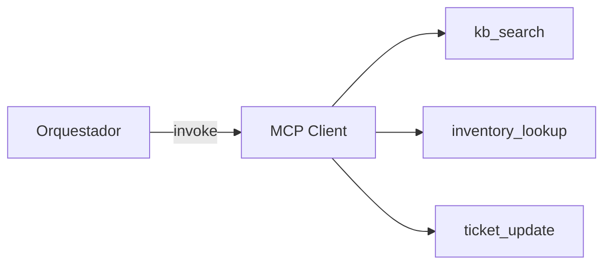

## Integración con MCPs y Orquestadores de IA

Este documento detalla cómo el microservicio IA se conecta con MCPs (Model Context Protocol) y orquestadores (p. ej., LangChain/LlamaIndex) para habilitar herramientas externas y flujos multi-paso.

### Objetivos de Integración
- **Acceso a herramientas externas**: búsqueda documental, ticketing, inventario de repuestos.
- **Razonamiento orquestado**: dividir el problema en sub-tareas (parseo, recuperación, inferencia, validación, respuesta).
- **Aislamiento y seguridad**: limitar capacidades y sanitizar entradas en cada tool.

### Arquitectura Lógica
- **MCP Client**: componente que descubre y llama herramientas MCP (vía servidor MCP).
- **Tooling**:
  - `kb_search`: consulta a la base de conocimiento/vector DB.
  - `inventory_lookup`: consulta de stock y compatibilidad de repuestos.
  - `ticket_update`: añade comentarios/feedback al sistema de tickets.
- **Orquestador**: gestiona el plan (chain/graph) y la memoria de la conversación por `traceId`.



### Contratos de Herramientas (ejemplo)

```yaml
kb_search:
  input:
    query: string
    top_k: number
  output:
    hits:
      - doc_id: string
        score: number
        snippet: string

inventory_lookup:
  input:
    modelo: string
    repuesto: string
  output:
    disponible: boolean
    sku: string
    eta_dias: number

ticket_update:
  input:
    ticket_id: string
    comentario: string
  output:
    ok: boolean
```

### Orquestación de Flujos
- `/predict-fallas`:
  1. NLP → extracción de entidades.
  2. Predicción → top-N fallas con confidencia.
  3. KB → recuperación de repuestos asociados.
  4. Inventory → verificación de stock.
  5. Ensamble de respuesta y trazabilidad.

- `/soporte-tecnico`:
  1. NLP → resumen y normalización de síntomas.
  2. KB → pasos base por modelo.
  3. Reglas → adaptar a contexto y nivel de detalle.

- `/validar-formulario`:
  1. Reglas → chequeos de coherencia y rango.
  2. NLP → detección de contradicciones en texto.
  3. Sugerencias de corrección.

### Seguridad y Observabilidad
- Sanitización de prompts/inputs antes de invocar tools.
- Timeouts y límites de tokens/recursos.
- Logging por `traceId` y métricas por tool (latencia, aciertos, errores).

### Configuración
- Variables de entorno sugeridas:
  - `MCP_SERVER_URL`, `MCP_API_KEY`
  - `ORCH_PROVIDER` = `langchain|llamaindex|custom`
  - `VECTOR_DB_URL`, `VECTOR_DB_API_KEY`


