# 🔗 Contratos de Integración con Knowledge Base

## 🎯 **Objetivo**

Definir los contratos y protocolos de comunicación entre el **Animal-AI Service** y el **Knowledge Base (KB)** existente, garantizando una integración fluida y sin afectar otros servicios.

---

## 📡 **Endpoints del KB Utilizados**

### **1. Ingestión de Datos**
```http
POST {ANIMAL_KB_URL}/tools/kb_ingest
Content-Type: application/json
Authorization: Bearer {ANIMAL_KB_AUTH_TOKEN}
```

**Request Body:**
```json
{
  "content": "string",
  "metadata": {
    "source_type": "animal_behavior",
    "animal_id": "string",
    "movement_type": "string",
    "timestamp": "ISO8601",
    "confidence": "float",
    "location": "string",
    "duration_seconds": "float",
    "coordinates": "array",
    "behavioral_context": "string",
    "environmental_conditions": "object",
    "quality_score": "float"
  }
}
```

**Response:**
```json
{
  "status": "success|error",
  "message": "string",
  "doc_id": "string",
  "metadata": "object"
}
```

### **2. Búsqueda en KB**
```http
POST {ANIMAL_KB_SEARCH_URL}/tools/kb_search
Content-Type: application/json
Authorization: Bearer {ANIMAL_KB_AUTH_TOKEN}
```

**Request Body:**
```json
{
  "query": "string",
  "limit": "integer",
  "filters": {
    "source_type": "animal_behavior",
    "animal_id": "string",
    "movement_type": "string",
    "date_from": "ISO8601",
    "date_to": "ISO8601",
    "confidence_min": "float"
  }
}
```

**Response:**
```json
{
  "hits": [
    {
      "doc_id": "string",
      "score": "float",
      "snippet": "string",
      "metadata": "object"
    }
  ],
  "total_hits": "integer",
  "query_time_ms": "integer"
}
```

---

## 🏗️ **Estructura de Metadatos para Animal Behavior**

### **Metadatos Obligatorios**
```json
{
  "source_type": "animal_behavior",
  "animal_id": "unique_animal_identifier",
  "timestamp": "2025-09-13T10:30:00Z",
  "extraction_date": "2025-09-13",
  "confidence": 0.85
}
```

### **Metadatos Específicos de Movimiento**
```json
{
  "movement_type": "walking|running|feeding|resting|social|unknown",
  "duration_seconds": 15.5,
  "coordinates": [
    {"x": 100.5, "y": 200.3, "timestamp": "2025-09-13T10:30:00Z"},
    {"x": 105.2, "y": 205.1, "timestamp": "2025-09-13T10:30:01Z"}
  ],
  "movement_velocity": 2.5,
  "movement_direction": 45.0,
  "movement_pattern": "linear|circular|erratic|stationary"
}
```

### **Metadatos de Contexto Ambiental**
```json
{
  "location_zone": "barn_1|pasture_a|feeding_area",
  "weather_conditions": "sunny|rainy|cloudy",
  "temperature_celsius": 22.5,
  "time_of_day": "morning|afternoon|evening|night",
  "other_animals_present": ["animal_002", "animal_003"],
  "human_presence": true,
  "feeding_time": false
}
```

### **Metadatos de Calidad y Procesamiento**
```json
{
  "quality_score": 0.92,
  "processing_version": "1.0.0",
  "model_version": "yolo_v8_animal_v1.2",
  "frame_quality": "high|medium|low",
  "lighting_conditions": "optimal|poor|artificial",
  "camera_angle": "front|side|top|multiple",
  "resolution": "1920x1080",
  "fps": 30
}
```

---

## 🔄 **Flujos de Integración**

### **Flujo 1: Ingestión de Movimiento Conocido**

```mermaid
sequenceDiagram
    participant AS as Animal-AI Service
    participant KB as Knowledge Base
    
    AS->>AS: Detectar movimiento
    AS->>AS: Clasificar como conocido
    AS->>AS: Generar narrativa
    AS->>KB: POST /tools/kb_ingest
    KB-->>AS: Confirmación + doc_id
    AS->>AS: Actualizar historial local
```


### **Flujo 2: Búsqueda de Patrones Similares**


### **Flujo 3: Actualización de Conocimiento**


---

## 📝 **Generación de Narrativas**

### **Template para Movimientos**
```python
def generate_movement_narrative(movement_data: dict) -> str:
    """Generar narrativa descriptiva para el KB"""
    
    template = """
    Movimiento de {animal_id}: {movement_type}
    
    Detalles del comportamiento:
    - Duración: {duration_seconds} segundos
    - Ubicación: {location_zone}
    - Hora: {time_of_day}
    - Velocidad promedio: {movement_velocity} m/s
    - Patrón de movimiento: {movement_pattern}
    
    Contexto ambiental:
    - Condiciones climáticas: {weather_conditions}
    - Temperatura: {temperature_celsius}°C
    - Otros animales presentes: {other_animals_count}
    - Presencia humana: {'Sí' if human_presence else 'No'}
    
    Análisis técnico:
    - Confianza de detección: {confidence:.2%}
    - Calidad de imagen: {frame_quality}
    - Modelo utilizado: {model_version}
    
    Coordenadas de movimiento:
    {coordinates_summary}
    
    Observaciones adicionales:
    {behavioral_notes}
    """
    
    return template.format(**movement_data)
```

### **Template para Patrones de Comportamiento**
```python
def generate_behavior_pattern_narrative(pattern_data: dict) -> str:
    """Generar narrativa para patrones de comportamiento"""
    
    template = """
    Patrón de comportamiento identificado en {animal_id}
    
    Tipo de patrón: {pattern_name}
    Frecuencia: {frequency} veces observado
    Confianza del patrón: {pattern_confidence:.2%}
    
    Secuencia de movimientos:
    {movement_sequence}
    
    Contexto típico:
    - Horario preferido: {preferred_time}
    - Ubicación común: {common_location}
    - Condiciones ambientales: {environmental_context}
    
    Correlaciones detectadas:
    {correlations}
    
    Implicaciones comportamentales:
    {behavioral_implications}
    """
    
    return template.format(**pattern_data)
```

---

## 🔍 **Filtros de Búsqueda Específicos**

### **Búsqueda por Animal Individual**
```json
{
  "query": "movimientos de alimentación",
  "filters": {
    "source_type": "animal_behavior",
    "animal_id": "cow_001",
    "movement_type": "feeding"
  }
}
```

### **Búsqueda por Patrón Temporal**
```json
{
  "query": "comportamiento nocturno",
  "filters": {
    "source_type": "animal_behavior",
    "time_of_day": "night",
    "date_from": "2025-09-01T00:00:00Z",
    "date_to": "2025-09-13T23:59:59Z"
  }
}
```

### **Búsqueda por Contexto Ambiental**
```json
{
  "query": "movimientos durante lluvia",
  "filters": {
    "source_type": "animal_behavior",
    "weather_conditions": "rainy",
    "confidence_min": 0.7
  }
}
```

---

## 🛡️ **Manejo de Errores y Reintentos**

### **Estrategia de Reintentos**
```python
class KBIntegrationClient:
    def __init__(self):
        self.max_retries = 3
        self.retry_delay = 1.0
        self.timeout = 30
    
    async def ingest_with_retry(self, data: dict) -> dict:
        """Ingerir datos con estrategia de reintentos"""
        for attempt in range(self.max_retries):
            try:
                response = await self.kb_ingest(data)
                return response
                
            except httpx.TimeoutException:
                if attempt == self.max_retries - 1:
                    raise
                await asyncio.sleep(self.retry_delay * (2 ** attempt))
                
            except httpx.HTTPStatusError as e:
                if e.response.status_code >= 500:
                    # Error del servidor, reintentar
                    if attempt == self.max_retries - 1:
                        raise
                    await asyncio.sleep(self.retry_delay * (2 ** attempt))
                else:
                    # Error del cliente, no reintentar
                    raise
```

### **Manejo de Errores Específicos**
```python
async def handle_kb_error(error: Exception, data: dict):
    """Manejar errores específicos del KB"""
    
    if isinstance(error, httpx.TimeoutException):
        # Guardar en cola local para reintento posterior
        await save_to_retry_queue(data)
        logger.warning("KB timeout, guardado para reintento")
        
    elif isinstance(error, httpx.HTTPStatusError):
        if error.response.status_code == 413:
            # Payload muy grande, dividir
            await split_and_ingest(data)
        elif error.response.status_code == 422:
            # Error de validación, revisar metadatos
            await validate_and_fix_metadata(data)
        else:
            logger.error(f"Error HTTP del KB: {error.response.status_code}")
            
    else:
        logger.error(f"Error desconocido del KB: {error}")
```

---

## 📊 **Métricas de Integración**

### **Métricas a Monitorear**
```python
KB_INTEGRATION_METRICS = {
    "kb_ingest_requests_total": "Total de requests de ingestión",
    "kb_ingest_success_total": "Ingestiones exitosas",
    "kb_ingest_errors_total": "Errores de ingestión",
    "kb_search_requests_total": "Total de búsquedas",
    "kb_search_response_time_seconds": "Tiempo de respuesta de búsquedas",
    "kb_connection_errors_total": "Errores de conexión",
    "kb_retry_attempts_total": "Intentos de reintento",
    "kb_queue_size": "Tamaño de cola de reintentos"
}
```

### **Alertas Configurables**
```yaml
alerts:
  kb_high_error_rate:
    condition: "kb_ingest_errors_total / kb_ingest_requests_total > 0.1"
    message: "Alta tasa de errores en KB (>10%)"
    
  kb_slow_response:
    condition: "kb_search_response_time_seconds > 5"
    message: "Respuestas lentas del KB (>5s)"
    
  kb_connection_down:
    condition: "kb_connection_errors_total > 5 in 5m"
    message: "Posible caída de conexión con KB"
```

---

## 🔧 **Configuración de Integración**

### **Variables de Entorno**
```bash
# URLs del KB
ANIMAL_KB_URL=http://kb-server:7070/tools/kb_ingest
ANIMAL_KB_SEARCH_URL=http://kb-server:7070/tools/kb_search

# Autenticación
ANIMAL_KB_AUTH_TOKEN=bearer-token-here

# Configuración de conexión
ANIMAL_KB_TIMEOUT=30
ANIMAL_KB_MAX_RETRIES=3
ANIMAL_KB_RETRY_DELAY=1.0

# Configuración de datos
ANIMAL_KB_SOURCE_TYPE=animal_behavior
ANIMAL_KB_QUALITY_THRESHOLD=0.8
ANIMAL_KB_BATCH_SIZE=10
ANIMAL_KB_MAX_CONTENT_LENGTH=10000
```

### **Validación de Configuración**
```python
def validate_kb_config(config: KBConfig) -> List[str]:
    """Validar configuración del KB"""
    errors = []
    
    if not config.url:
        errors.append("ANIMAL_KB_URL es requerido")
        
    if not config.search_url:
        errors.append("ANIMAL_KB_SEARCH_URL es requerido")
        
    if config.timeout <= 0:
        errors.append("ANIMAL_KB_TIMEOUT debe ser positivo")
        
    if not (0.0 <= config.quality_threshold <= 1.0):
        errors.append("ANIMAL_KB_QUALITY_THRESHOLD debe estar entre 0.0 y 1.0")
        
    return errors
```

---

## ✅ **Testing de Integración**

### **Tests de Conectividad**
```python
async def test_kb_connectivity():
    """Test básico de conectividad con KB"""
    test_data = {
        "content": "Test de conectividad Animal-AI Service",
        "metadata": {
            "source_type": "animal_behavior",
            "animal_id": "test_animal",
            "timestamp": datetime.now().isoformat(),
            "test": True
        }
    }
    
    response = await kb_client.ingest(test_data)
    assert response["status"] == "success"
```

### **Tests de Búsqueda**
```python
async def test_kb_search():
    """Test de funcionalidad de búsqueda"""
    search_query = {
        "query": "test animal behavior",
        "filters": {
            "source_type": "animal_behavior",
            "test": True
        },
        "limit": 5
    }
    
    response = await kb_client.search(search_query)
    assert "hits" in response
    assert isinstance(response["hits"], list)
```

---

**Este contrato garantiza una integración robusta, escalable y mantenible entre el Animal-AI Service y el Knowledge Base existente, sin afectar otros servicios del ecosistema FixeatAI.** 🐾🔗


