# 📹 Sistema Multi-Cámara - Despliegue Rápido

## 🎯 **Objetivo**

Implementar un sistema que permita agregar múltiples cámaras de forma rápida y sencilla, con auto-descubrimiento y configuración mínima.

---

## 🏗️ **Arquitectura Multi-Cámara**

```mermaid
graph TB
    subgraph "Cámaras Distribuidas"
        C1[📹 Cámara 1<br/>Barn A]
        C2[📹 Cámara 2<br/>Pasture B]
        C3[📹 Cámara 3<br/>Feeding Area]
        C4[📹 Cámara N<br/>New Zone]
    end
    
    subgraph "Camera Discovery Service"
        DS[🔍 Discovery Service<br/>Puerto 8090]
        CR[📋 Camera Registry]
    end
    
    subgraph "Animal-AI Instances"
        AI1[🤖 Animal-AI 1<br/>Puerto 8081]
        AI2[🤖 Animal-AI 2<br/>Puerto 8082]
        AI3[🤖 Animal-AI 3<br/>Puerto 8083]
        AIN[🤖 Animal-AI N<br/>Puerto 808X]
    end
    
    subgraph "Central Management"
        LB[⚖️ Load Balancer<br/>Puerto 8080]
        KB[💾 Knowledge Base]
        DASH[📊 Dashboard Central]
    end
    
    C1 --> DS
    C2 --> DS
    C3 --> DS
    C4 --> DS
    
    DS --> AI1
    DS --> AI2
    DS --> AI3
    DS --> AIN
    
    AI1 --> KB
    AI2 --> KB
    AI3 --> KB
    AIN --> KB
    
    LB --> AI1
    LB --> AI2
    LB --> AI3
    LB --> AIN
    
    DASH --> LB
    DASH --> KB
```



---

## 🚀 **Soluciones de Despliegue Rápido**

### **Opción 1: Auto-Discovery con Docker Swarm**

#### **1.1 Configuración de Cámara (Plug & Play)**
```yaml
# camera-config.yml (se coloca junto a cada cámara)
version: "3.9"
services:
  camera-agent:
    image: fixeatai/camera-agent:latest
    container_name: camera-${CAMERA_ID}
    restart: unless-stopped
    environment:
      - CAMERA_ID=${CAMERA_ID:-auto}
      - CAMERA_NAME=${CAMERA_NAME:-Camera}
      - CAMERA_LOCATION=${CAMERA_LOCATION:-Unknown}
      - CAMERA_STREAM_URL=${CAMERA_STREAM_URL}
      - DISCOVERY_SERVICE_URL=http://discovery:8090
      - AUTO_REGISTER=true
    networks:
      - animal-ai-network
    deploy:
      replicas: 1
      placement:
        constraints:
          - node.labels.camera_zone == ${CAMERA_ZONE}

networks:
  animal-ai-network:
    external: true
```

#### **1.2 Script de Instalación Rápida**
```bash
#!/bin/bash
# install-camera.sh - Script de instalación en 1 minuto

echo "🎥 FixeatAI - Instalación Rápida de Cámara"
echo "=========================================="

# Detectar información de la cámara
read -p "ID de la cámara (ej: barn_001): " CAMERA_ID
read -p "Nombre descriptivo: " CAMERA_NAME
read -p "Ubicación (ej: Barn A): " CAMERA_LOCATION
read -p "URL del stream (ej: rtsp://192.168.1.100/stream): " CAMERA_STREAM_URL

# Crear archivo de configuración
cat > .env << EOF
CAMERA_ID=${CAMERA_ID}
CAMERA_NAME=${CAMERA_NAME}
CAMERA_LOCATION=${CAMERA_LOCATION}
CAMERA_STREAM_URL=${CAMERA_STREAM_URL}
CAMERA_ZONE=${CAMERA_LOCATION// /_}
EOF

# Descargar y ejecutar
curl -o docker-compose.yml https://raw.githubusercontent.com/fixeatai/camera-configs/main/docker-compose.yml
docker-compose up -d

echo "✅ Cámara ${CAMERA_NAME} instalada y registrada!"
echo "🌐 Dashboard: http://your-server:8080/cameras/${CAMERA_ID}"
```

### **Opción 2: Raspberry Pi con Imagen Pre-configurada**

#### **2.1 Imagen SD Card Lista**
```bash
# Crear imagen Raspberry Pi con todo pre-instalado
# La imagen incluye:
# - Docker pre-instalado
# - Animal-AI Camera Agent
# - Auto-discovery habilitado
# - WiFi configurado
# - SSH habilitado

# Proceso de instalación:
# 1. Flashear SD card con imagen FixeatAI
# 2. Conectar cámara USB/CSI
# 3. Encender Raspberry Pi
# 4. Acceder via SSH o interfaz web local
# 5. Configurar en 3 pasos
```

#### **2.2 Configuración Web Simple**
```html
<!-- Interfaz web local en Raspberry Pi -->
<!DOCTYPE html>
<html>
<head>
    <title>FixeatAI Camera Setup</title>
</head>
<body>
    <h1>🎥 Configuración de Cámara FixeatAI</h1>
    
    <form id="camera-setup">
        <div>
            <label>Nombre de la cámara:</label>
            <input type="text" id="camera-name" placeholder="Ej: Cámara Establo A">
        </div>
        
        <div>
            <label>Ubicación:</label>
            <input type="text" id="location" placeholder="Ej: Establo A - Zona Norte">
        </div>
        
        <div>
            <label>Tipo de animales:</label>
            <select id="animal-type">
                <option value="bovine">Ganado Bovino</option>
                <option value="porcine">Ganado Porcino</option>
                <option value="ovine">Ganado Ovino</option>
                <option value="poultry">Aves de Corral</option>
                <option value="other">Otros</option>
            </select>
        </div>
        
        <div>
            <label>Servidor Central:</label>
            <input type="text" id="server-url" placeholder="http://192.168.1.10:8080">
        </div>
        
        <button type="submit">🚀 Activar Cámara</button>
    </form>
    
    <div id="status"></div>
</body>
</html>
```

### **Opción 3: Instalación con QR Code**

#### **3.1 Generación de QR Dinámico**
```python
# generate_camera_qr.py
import qrcode
import json
from datetime import datetime

def generate_camera_qr(camera_config):
    """Generar QR code con configuración de cámara"""
    
    config_data = {
        "type": "fixeatai_camera",
        "version": "1.0",
        "timestamp": datetime.now().isoformat(),
        "config": {
            "discovery_url": camera_config["discovery_url"],
            "camera_id": camera_config["camera_id"],
            "location": camera_config["location"],
            "preset": camera_config.get("preset", "default")
        },
        "install_script": "curl -sSL https://install.fixeatai.com/camera | bash"
    }
    
    # Crear QR code
    qr = qrcode.QRCode(version=1, box_size=10, border=5)
    qr.add_data(json.dumps(config_data))
    qr.make(fit=True)
    
    return qr.make_image(fill_color="black", back_color="white")

# Uso
camera_config = {
    "discovery_url": "http://192.168.1.10:8090",
    "camera_id": "barn_001",
    "location": "Barn A",
    "preset": "livestock_monitoring"
}

qr_image = generate_camera_qr(camera_config)
qr_image.save("camera_barn_001_setup.png")
```

#### **3.2 App Móvil de Configuración**
```javascript
// Mobile app para escanear QR y configurar cámara
class CameraSetupApp {
    async scanQRCode() {
        const result = await BarcodeScanner.scan();
        const config = JSON.parse(result.text);
        
        if (config.type === "fixeatai_camera") {
            await this.setupCamera(config);
        }
    }
    
    async setupCamera(config) {
        // 1. Conectar a la cámara via WiFi
        await this.connectToCamera(config.camera_id);
        
        // 2. Enviar configuración
        await this.sendConfig(config);
        
        // 3. Verificar conexión con servidor central
        await this.testConnection(config.discovery_url);
        
        // 4. Mostrar confirmación
        this.showSuccess(`Cámara ${config.camera_id} configurada!`);
    }
}
```

---

## 🔧 **Camera Discovery Service**

### **Servicio de Auto-Descubrimiento**
```python
# camera_discovery_service.py
from fastapi import FastAPI, HTTPException
from pydantic import BaseModel
from typing import Dict, List
import asyncio
import docker
import logging

app = FastAPI(title="Camera Discovery Service", port=8090)

class CameraRegistration(BaseModel):
    camera_id: str
    name: str
    location: str
    stream_url: str
    capabilities: List[str]
    hardware_info: Dict[str, str]

class CameraRegistry:
    def __init__(self):
        self.cameras: Dict[str, CameraRegistration] = {}
        self.docker_client = docker.from_env()
    
    async def register_camera(self, camera: CameraRegistration):
        """Registrar nueva cámara y crear instancia Animal-AI"""
        
        # 1. Registrar cámara
        self.cameras[camera.camera_id] = camera
        logging.info(f"📹 Cámara registrada: {camera.camera_id}")
        
        # 2. Crear instancia Animal-AI dedicada
        await self.create_animal_ai_instance(camera)
        
        # 3. Configurar load balancer
        await self.update_load_balancer()
        
        return {"status": "registered", "camera_id": camera.camera_id}
    
    async def create_animal_ai_instance(self, camera: CameraRegistration):
        """Crear instancia Animal-AI para la cámara"""
        
        # Encontrar puerto disponible
        port = await self.find_available_port()
        
        # Configuración del contenedor
        container_config = {
            "image": "fixeatai/animal-ai:latest",
            "name": f"animal-ai-{camera.camera_id}",
            "ports": {f"{port}/tcp": port},
            "environment": {
                "ANIMAL_SERVICE_PORT": str(port),
                "ANIMAL_SERVICE_NAME": f"animal-ai-{camera.camera_id}",
                "ANIMAL_VIDEO_SOURCE": camera.stream_url,
                "ANIMAL_CAMERA_ID": camera.camera_id,
                "ANIMAL_CAMERA_LOCATION": camera.location,
                "ANIMAL_KB_URL": "http://kb-service:7070/tools/kb_ingest",
                "ANIMAL_DISCOVERY_SERVICE": "http://discovery:8090"
            },
            "restart_policy": {"Name": "unless-stopped"},
            "networks": ["animal-ai-network"]
        }
        
        # Crear y ejecutar contenedor
        container = self.docker_client.containers.run(
            detach=True,
            **container_config
        )
        
        logging.info(f"🤖 Instancia Animal-AI creada: {container.name} en puerto {port}")
        
        return {"container_id": container.id, "port": port}

# Endpoints del Discovery Service
@app.post("/api/v1/cameras/register")
async def register_camera(camera: CameraRegistration):
    """Endpoint para registrar nueva cámara"""
    registry = CameraRegistry()
    result = await registry.register_camera(camera)
    return result

@app.get("/api/v1/cameras")
async def list_cameras():
    """Listar todas las cámaras registradas"""
    registry = CameraRegistry()
    return {"cameras": list(registry.cameras.values())}

@app.delete("/api/v1/cameras/{camera_id}")
async def unregister_camera(camera_id: str):
    """Desregistrar cámara y limpiar recursos"""
    registry = CameraRegistry()
    await registry.unregister_camera(camera_id)
    return {"status": "unregistered", "camera_id": camera_id}
```

---

## 📱 **Herramientas de Instalación**

### **1. Script de Instalación Universal**
```bash
#!/bin/bash
# universal-install.sh

INSTALL_TYPE=${1:-"interactive"}
CAMERA_CONFIG=${2:-""}

echo "🎥 FixeatAI Universal Camera Installer"
echo "======================================"

# Detectar sistema operativo
detect_os() {
    if [[ "$OSTYPE" == "linux-gnu"* ]]; then
        if command -v apt-get &> /dev/null; then
            OS="ubuntu"
        elif command -v yum &> /dev/null; then
            OS="centos"
        fi
    elif [[ "$OSTYPE" == "darwin"* ]]; then
        OS="macos"
    fi
    echo "Sistema detectado: $OS"
}

# Instalar Docker si no existe
install_docker() {
    if ! command -v docker &> /dev/null; then
        echo "📦 Instalando Docker..."
        curl -fsSL https://get.docker.com -o get-docker.sh
        sh get-docker.sh
        sudo usermod -aG docker $USER
        echo "✅ Docker instalado"
    fi
}

# Configuración interactiva
interactive_setup() {
    echo "🔧 Configuración Interactiva"
    echo "============================"
    
    read -p "ID de la cámara: " CAMERA_ID
    read -p "Nombre: " CAMERA_NAME
    read -p "Ubicación: " CAMERA_LOCATION
    read -p "URL del stream: " CAMERA_STREAM_URL
    read -p "Servidor central: " DISCOVERY_URL
    
    # Crear configuración
    cat > camera-config.json << EOF
{
    "camera_id": "$CAMERA_ID",
    "name": "$CAMERA_NAME",
    "location": "$CAMERA_LOCATION",
    "stream_url": "$CAMERA_STREAM_URL",
    "discovery_url": "$DISCOVERY_URL"
}
EOF
}

# Instalación automática
auto_install() {
    echo "🚀 Instalación Automática"
    echo "========================="
    
    # Descargar configuración desde QR o URL
    if [[ $CAMERA_CONFIG == http* ]]; then
        curl -o camera-config.json $CAMERA_CONFIG
    else
        echo $CAMERA_CONFIG > camera-config.json
    fi
}

# Desplegar cámara
deploy_camera() {
    echo "🎬 Desplegando cámara..."
    
    # Descargar docker-compose
    curl -o docker-compose.yml https://raw.githubusercontent.com/fixeatai/configs/main/camera/docker-compose.yml
    
    # Configurar variables de entorno
    source camera-config.json
    export CAMERA_ID CAMERA_NAME CAMERA_LOCATION CAMERA_STREAM_URL DISCOVERY_URL
    
    # Ejecutar
    docker-compose up -d
    
    echo "✅ Cámara desplegada exitosamente!"
    echo "🌐 Accede al dashboard: $DISCOVERY_URL/cameras/$CAMERA_ID"
}

# Flujo principal
main() {
    detect_os
    install_docker
    
    if [[ $INSTALL_TYPE == "interactive" ]]; then
        interactive_setup
    else
        auto_install
    fi
    
    deploy_camera
}

main "$@"
```

### **2. Aplicación Web de Gestión**
```html
<!-- camera-manager.html -->
<!DOCTYPE html>
<html>
<head>
    <title>FixeatAI Camera Manager</title>
    <script src="https://cdn.jsdelivr.net/npm/vue@2"></script>
</head>
<body>
    <div id="app">
        <h1>🎥 Gestor de Cámaras FixeatAI</h1>
        
        <!-- Agregar nueva cámara -->
        <div class="add-camera">
            <h2>➕ Agregar Nueva Cámara</h2>
            <form @submit.prevent="addCamera">
                <input v-model="newCamera.name" placeholder="Nombre de la cámara" required>
                <input v-model="newCamera.location" placeholder="Ubicación" required>
                <input v-model="newCamera.stream_url" placeholder="URL del stream" required>
                <button type="submit">🚀 Agregar Cámara</button>
            </form>
        </div>
        
        <!-- Lista de cámaras -->
        <div class="cameras-list">
            <h2>📹 Cámaras Activas ({{ cameras.length }})</h2>
            <div v-for="camera in cameras" :key="camera.camera_id" class="camera-card">
                <h3>{{ camera.name }}</h3>
                <p><strong>ID:</strong> {{ camera.camera_id }}</p>
                <p><strong>Ubicación:</strong> {{ camera.location }}</p>
                <p><strong>Estado:</strong> 
                    <span :class="camera.status">{{ camera.status }}</span>
                </p>
                <div class="camera-actions">
                    <button @click="viewCamera(camera.camera_id)">👁️ Ver</button>
                    <button @click="configureCamera(camera.camera_id)">⚙️ Configurar</button>
                    <button @click="removeCamera(camera.camera_id)" class="danger">🗑️ Eliminar</button>
                </div>
            </div>
        </div>
        
        <!-- Generador de QR -->
        <div class="qr-generator">
            <h2>📱 Generador de QR</h2>
            <button @click="generateQR">🔲 Generar QR para Instalación Rápida</button>
            <div v-if="qrCode" class="qr-display">
                
                <p>Escanea este código con la app móvil FixeatAI</p>
            </div>
        </div>
    </div>

    <script>
        new Vue({
            el: '#app',
            data: {
                cameras: [],
                newCamera: {
                    name: '',
                    location: '',
                    stream_url: ''
                },
                qrCode: null
            },
            methods: {
                async addCamera() {
                    const response = await fetch('/api/v1/cameras/register', {
                        method: 'POST',
                        headers: {'Content-Type': 'application/json'},
                        body: JSON.stringify({
                            camera_id: this.generateCameraId(),
                            ...this.newCamera,
                            capabilities: ['video_analysis', 'animal_detection'],
                            hardware_info: {}
                        })
                    });
                    
                    if (response.ok) {
                        this.loadCameras();
                        this.newCamera = {name: '', location: '', stream_url: ''};
                        alert('✅ Cámara agregada exitosamente!');
                    }
                },
                
                async loadCameras() {
                    const response = await fetch('/api/v1/cameras');
                    const data = await response.json();
                    this.cameras = data.cameras;
                },
                
                generateCameraId() {
                    return 'cam_' + Date.now();
                },
                
                async generateQR() {
                    const config = {
                        discovery_url: window.location.origin,
                        preset: 'quick_setup'
                    };
                    
                    const response = await fetch('/api/v1/qr/generate', {
                        method: 'POST',
                        headers: {'Content-Type': 'application/json'},
                        body: JSON.stringify(config)
                    });
                    
                    const blob = await response.blob();
                    this.qrCode = URL.createObjectURL(blob);
                }
            },
            
            mounted() {
                this.loadCameras();
            }
        });
    </script>
</body>
</html>
```

---

## 🔄 **Flujos de Instalación**

### **Flujo 1: Instalación Express (< 5 minutos)**

```mermaid
sequenceDiagram
    participant U as Usuario
    participant QR as QR Code
    participant PI as Raspberry Pi
    participant DS as Discovery Service
    participant AI as Animal-AI Instance
    
    U->>QR: Escanear QR con app móvil
    QR->>PI: Enviar configuración WiFi + Camera
    PI->>PI: Auto-configurar red y servicios
    PI->>DS: Registrar cámara automáticamente
    DS->>AI: Crear instancia dedicada
    AI->>U: Notificación: "Cámara lista!"
```


### **Flujo 2: Instalación Web (< 10 minutos)**

```mermaid
sequenceDiagram
    participant U as Usuario
    participant WEB as Interfaz Web
    participant DS as Discovery Service
    participant DOCKER as Docker
    participant AI as Animal-AI
    
    U->>WEB: Acceder a interfaz de configuración
    WEB->>U: Formulario de configuración
    U->>WEB: Completar datos de cámara
    WEB->>DS: Registrar nueva cámara
    DS->>DOCKER: Crear contenedor Animal-AI
    DOCKER->>AI: Iniciar instancia
    AI->>U: Dashboard disponible
```


### **Flujo 3: Instalación por Script (< 3 minutos)**
```bash
# Una sola línea de comando
curl -sSL https://install.fixeatai.com/camera | bash -s -- \
  --camera-id="barn_001" \
  --location="Barn A" \
  --stream="rtsp://192.168.1.100/stream" \
  --server="http://192.168.1.10:8090"
```

---

## 📊 **Dashboard Multi-Cámara**

### **Vista Unificada**
```javascript
// dashboard-multi-camera.js
class MultiCameraDashboard {
    constructor() {
        this.cameras = new Map();
        this.wsConnections = new Map();
    }
    
    async loadCameras() {
        const response = await fetch('/api/v1/cameras');
        const data = await response.json();
        
        data.cameras.forEach(camera => {
            this.addCameraToGrid(camera);
            this.connectWebSocket(camera.camera_id);
        });
    }
    
    addCameraToGrid(camera) {
        const grid = document.getElementById('camera-grid');
        const cameraElement = document.createElement('div');
        cameraElement.className = 'camera-tile';
        cameraElement.innerHTML = `
            <div class="camera-header">
                <h3>${camera.name}</h3>
                <span class="status ${camera.status}">${camera.status}</span>
            </div>
            <div class="camera-preview">
                
            </div>
            <div class="camera-stats">
                <div class="stat">
                    <span class="label">Animales:</span>
                    <span class="value" id="animals-${camera.camera_id}">0</span>
                </div>
                <div class="stat">
                    <span class="label">Movimientos:</span>
                    <span class="value" id="movements-${camera.camera_id}">0</span>
                </div>
            </div>
            <div class="camera-actions">
                <button onclick="viewFullscreen('${camera.camera_id}')">🔍</button>
                <button onclick="configureCamera('${camera.camera_id}')">⚙️</button>
            </div>
        `;
        
        grid.appendChild(cameraElement);
    }
    
    connectWebSocket(cameraId) {
        const ws = new WebSocket(`ws://localhost:8080/ws/camera/${cameraId}/live`);
        
        ws.onmessage = (event) => {
            const data = JSON.parse(event.data);
            this.updateCameraStats(cameraId, data);
        };
        
        this.wsConnections.set(cameraId, ws);
    }
    
    updateCameraStats(cameraId, data) {
        document.getElementById(`animals-${cameraId}`).textContent = data.total_animals;
        document.getElementById(`movements-${cameraId}`).textContent = data.total_movements;
        
        // Actualizar preview si hay nueva imagen
        if (data.preview_frame) {
            document.getElementById(`preview-${cameraId}`).src = 
                `data:image/jpeg;base64,${data.preview_frame}`;
        }
    }
}

// Inicializar dashboard
const dashboard = new MultiCameraDashboard();
dashboard.loadCameras();
```

---

## ✅ **Ventajas del Sistema Multi-Cámara**

### **🚀 Instalación Rápida**
- ⏱️ **< 5 minutos**: Instalación completa
- 📱 **QR Code**: Configuración automática
- 🔧 **Plug & Play**: Sin configuración manual
- 📋 **Auto-discovery**: Detección automática

### **📈 Escalabilidad**
- 🔄 **Horizontal**: Agregar cámaras sin límite
- ⚖️ **Load Balancing**: Distribución automática de carga
- 🏗️ **Microservicios**: Instancia dedicada por cámara
- 📊 **Monitoreo**: Dashboard unificado

### **🔧 Mantenimiento**
- 🔄 **Auto-updates**: Actualizaciones automáticas
- 📊 **Health checks**: Monitoreo de salud
- 🚨 **Alertas**: Notificaciones automáticas
- 🔧 **Remote config**: Configuración remota

### **💰 Costo-Efectivo**
- 🏠 **Hardware económico**: Raspberry Pi
- ☁️ **Edge computing**: Procesamiento local
- 📡 **Bandwidth optimizado**: Solo metadatos al servidor
- 🔋 **Bajo consumo**: Eficiencia energética

---

**¿Te gustaría que implemente alguna de estas soluciones específicas o necesitas más detalles sobre algún componente?** 📹🚀


