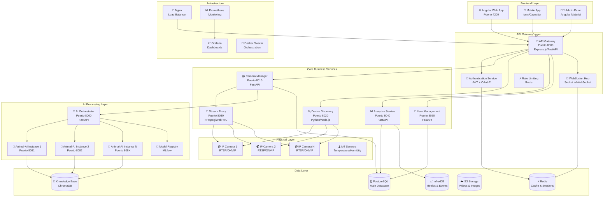
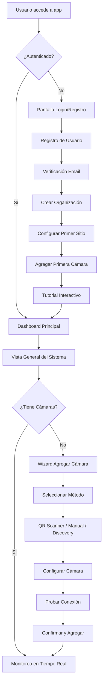
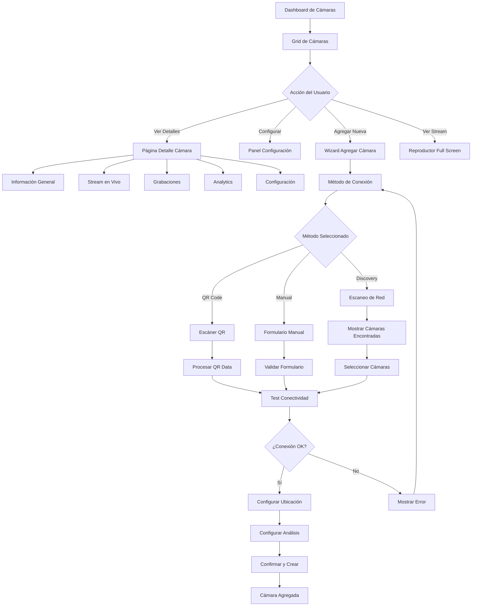
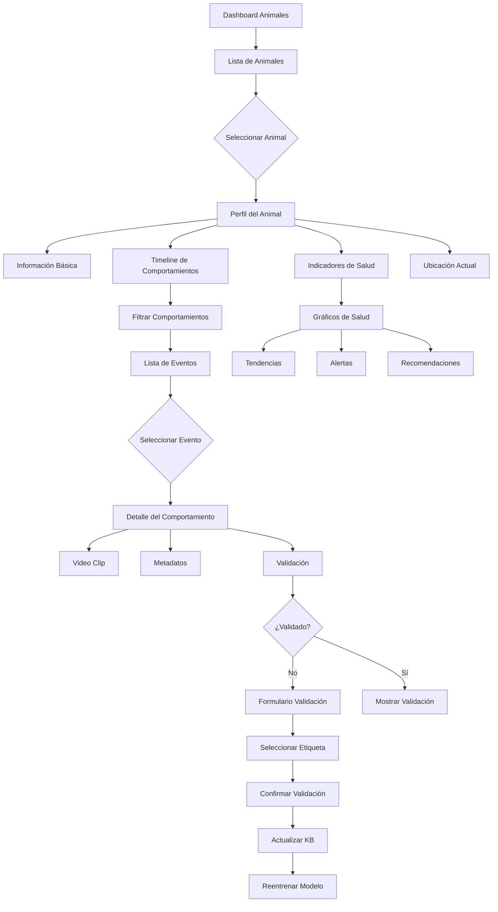

# 🏗️ Modelo de Arquitectura del Sistema Animal-AI

## 🎯 **Visión General**

Sistema completo de monitoreo y análisis de comportamiento animal con arquitectura **Backend API + Frontend Angular**, similar a **EZVIZ/Hik-Connect** pero especializado en análisis inteligente de animales.

---

## 🏗️ **Arquitectura del Sistema Completo**



---

## 🗄️ **Modelos de Datos**

### **👤 Usuario y Autenticación**

```typescript
interface User {
  id: string;
  email: string;
  name: string;
  avatar_url?: string;
  role: UserRole;
  organization_id: string;
  preferences: UserPreferences;
  two_factor_enabled: boolean;
  last_login: Date;
  created_at: Date;
  updated_at: Date;
  is_active: boolean;
}

enum UserRole {
  SUPER_ADMIN = 'super_admin',
  ORG_ADMIN = 'org_admin',
  SITE_MANAGER = 'site_manager',
  OPERATOR = 'operator',
  VIEWER = 'viewer'
}

interface UserPreferences {
  language: string;
  timezone: string;
  notifications: NotificationSettings;
  dashboard_layout: DashboardLayout;
  default_view: 'grid' | 'list' | 'map';
  theme: 'light' | 'dark' | 'auto';
}

interface NotificationSettings {
  email_alerts: boolean;
  push_notifications: boolean;
  sms_alerts: boolean;
  alert_types: AlertType[];
  quiet_hours: {
    enabled: boolean;
    start_time: string;
    end_time: string;
  };
}
```

### **🏢 Organización y Sitios**

```typescript
interface Organization {
  id: string;
  name: string;
  slug: string;
  logo_url?: string;
  plan: SubscriptionPlan;
  billing_info: BillingInfo;
  settings: OrganizationSettings;
  limits: OrganizationLimits;
  created_at: Date;
  updated_at: Date;
}

enum SubscriptionPlan {
  FREE = 'free',
  STARTER = 'starter',
  PROFESSIONAL = 'professional',
  ENTERPRISE = 'enterprise'
}

interface OrganizationLimits {
  max_cameras: number;
  max_sites: number;
  max_users: number;
  max_storage_gb: number;
  max_ai_instances: number;
  retention_days: number;
}

interface Site {
  id: string;
  name: string;
  description?: string;
  organization_id: string;
  address: Address;
  coordinates: GeoCoordinates;
  site_type: SiteType;
  animal_types: AnimalType[];
  zones: Zone[];
  settings: SiteSettings;
  created_at: Date;
  updated_at: Date;
  created_by: string;
}

enum SiteType {
  FARM = 'farm',
  RANCH = 'ranch',
  DAIRY = 'dairy',
  RESEARCH_FACILITY = 'research_facility',
  ZOO = 'zoo',
  WILDLIFE_RESERVE = 'wildlife_reserve',
  VETERINARY_CLINIC = 'veterinary_clinic',
  INDUSTRIAL = 'industrial'
}

interface Zone {
  id: string;
  site_id: string;
  name: string;
  description?: string;
  zone_type: ZoneType;
  animal_capacity: number;
  current_animal_count: number;
  cameras: string[]; // camera IDs
  sensors: string[]; // sensor IDs
  boundaries: GeoPolygon;
  settings: ZoneSettings;
  created_at: Date;
  updated_at: Date;
}

enum ZoneType {
  BARN = 'barn',
  STABLE = 'stable',
  PASTURE = 'pasture',
  FEEDING_AREA = 'feeding_area',
  MEDICAL_AREA = 'medical_area',
  QUARANTINE = 'quarantine',
  BREEDING_AREA = 'breeding_area',
  MILKING_PARLOR = 'milking_parlor',
  OTHER = 'other'
}
```

### **📹 Cámaras y Dispositivos**

```typescript
interface Camera {
  id: string;
  name: string;
  description?: string;
  organization_id: string;
  site_id: string;
  zone_id?: string;
  
  // Información del dispositivo
  device_info: DeviceInfo;
  
  // Conexión
  connection: CameraConnection;
  
  // Estado
  status: CameraStatus;
  health: CameraHealth;
  
  // Ubicación física
  location: CameraLocation;
  
  // Configuración de análisis
  analysis_config: AnalysisConfig;
  
  // Instancia AI asociada
  ai_instance_id?: string;
  
  // Configuración de grabación
  recording_config: RecordingConfig;
  
  // Metadatos
  tags: string[];
  custom_fields: Record<string, any>;
  created_at: Date;
  updated_at: Date;
  created_by: string;
  last_maintenance: Date;
}

interface DeviceInfo {
  manufacturer: string;
  model: string;
  firmware_version?: string;
  serial_number?: string;
  mac_address?: string;
  ip_address: string;
  port: number;
  device_type: 'ip_camera' | 'usb_camera' | 'ptz_camera' | 'thermal_camera';
  capabilities: DeviceCapability[];
}

enum DeviceCapability {
  PTZ = 'ptz',
  ZOOM = 'zoom',
  NIGHT_VISION = 'night_vision',
  AUDIO = 'audio',
  TWO_WAY_AUDIO = 'two_way_audio',
  MOTION_DETECTION = 'motion_detection',
  THERMAL = 'thermal',
  ONVIF = 'onvif'
}

interface CameraConnection {
  type: ConnectionType;
  primary_url: string;
  backup_url?: string;
  credentials?: CameraCredentials;
  quality_profiles: QualityProfile[];
  connection_timeout: number;
  retry_attempts: number;
  keep_alive_interval: number;
}

enum ConnectionType {
  RTSP = 'rtsp',
  HTTP = 'http',
  HTTPS = 'https',
  ONVIF = 'onvif',
  USB = 'usb',
  WEBRTC = 'webrtc'
}

interface CameraCredentials {
  username: string;
  password: string;
  auth_type: 'basic' | 'digest' | 'token';
}

interface QualityProfile {
  name: string;
  resolution: string; // "1920x1080"
  fps: number;
  bitrate: number;
  codec: 'h264' | 'h265' | 'mjpeg';
  url: string;
}

enum CameraStatus {
  ONLINE = 'online',
  OFFLINE = 'offline',
  ERROR = 'error',
  MAINTENANCE = 'maintenance',
  CONFIGURING = 'configuring',
  UPDATING = 'updating'
}

interface CameraHealth {
  score: number; // 0-100
  last_check: Date;
  uptime_percentage: number;
  avg_response_time_ms: number;
  error_count_24h: number;
  issues: HealthIssue[];
}

interface HealthIssue {
  type: 'connection' | 'stream' | 'hardware' | 'performance';
  severity: 'low' | 'medium' | 'high' | 'critical';
  message: string;
  first_detected: Date;
  last_detected: Date;
  count: number;
}

interface CameraLocation {
  coordinates?: GeoCoordinates;
  indoor_position?: IndoorPosition;
  orientation: number; // grados (0-360)
  height_meters?: number;
  tilt_angle?: number; // grados (-90 a 90)
  field_of_view: number; // grados
  coverage_area?: GeoPolygon;
  mounting_type: 'wall' | 'ceiling' | 'pole' | 'ground' | 'mobile';
}

interface IndoorPosition {
  building: string;
  floor: string;
  room: string;
  x_coordinate?: number;
  y_coordinate?: number;
}

interface AnalysisConfig {
  enabled: boolean;
  animal_detection: AnimalDetectionConfig;
  behavior_analysis: BehaviorAnalysisConfig;
  alerts: AlertConfig[];
  recording_triggers: RecordingTrigger[];
  privacy_zones: PrivacyZone[];
}

interface AnimalDetectionConfig {
  enabled: boolean;
  confidence_threshold: number;
  target_species: AnimalSpecies[];
  max_animals_per_frame: number;
  tracking_enabled: boolean;
  identification_enabled: boolean;
}

interface BehaviorAnalysisConfig {
  enabled: boolean;
  behavior_types: BehaviorType[];
  sensitivity: 'low' | 'medium' | 'high';
  learning_enabled: boolean;
  validation_required: boolean;
}

interface RecordingConfig {
  enabled: boolean;
  mode: 'continuous' | 'motion' | 'scheduled' | 'event';
  quality: 'low' | 'medium' | 'high' | 'ultra';
  retention_days: number;
  storage_location: 'local' | 'cloud' | 'hybrid';
  pre_record_seconds: number;
  post_record_seconds: number;
}
```

### **🐄 Animales y Comportamientos**

```typescript
interface Animal {
  id: string;
  organization_id: string;
  site_id: string;
  zone_id?: string;
  
  // Identificación
  tag_id?: string;
  name?: string;
  species: AnimalSpecies;
  breed?: string;
  
  // Características físicas
  physical_markers: PhysicalMarker[];
  estimated_age_months?: number;
  estimated_weight_kg?: number;
  gender?: 'male' | 'female' | 'unknown';
  
  // Estado
  status: AnimalStatus;
  current_location?: AnimalLocation;
  
  // Historial
  first_detected: Date;
  last_seen: Date;
  total_detections: number;
  total_behaviors: number;
  
  // Análisis
  behavior_profile: BehaviorProfile;
  health_indicators: HealthIndicators;
  
  // Metadatos
  notes?: string;
  custom_fields: Record<string, any>;
  created_at: Date;
  updated_at: Date;
}

enum AnimalSpecies {
  BOVINE = 'bovine',
  PORCINE = 'porcine',
  OVINE = 'ovine',
  CAPRINE = 'caprine',
  EQUINE = 'equine',
  POULTRY = 'poultry',
  CANINE = 'canine',
  FELINE = 'feline',
  OTHER = 'other'
}

interface PhysicalMarker {
  type: 'color_pattern' | 'size' | 'distinctive_feature' | 'tag' | 'brand';
  description: string;
  confidence: number;
  image_url?: string;
  detected_by: 'ai' | 'manual';
  created_at: Date;
}

enum AnimalStatus {
  ACTIVE = 'active',
  INACTIVE = 'inactive',
  MEDICAL_ATTENTION = 'medical_attention',
  QUARANTINE = 'quarantine',
  SOLD = 'sold',
  DECEASED = 'deceased',
  MISSING = 'missing'
}

interface AnimalLocation {
  zone_id: string;
  camera_id: string;
  coordinates: Point2D;
  confidence: number;
  timestamp: Date;
}

interface BehaviorEvent {
  id: string;
  animal_id: string;
  camera_id: string;
  
  // Evento
  event_type: BehaviorType;
  confidence: number;
  duration_seconds: number;
  intensity: 'low' | 'medium' | 'high';
  
  // Contexto temporal
  timestamp: Date;
  time_of_day: TimeOfDay;
  day_of_week: number; // 0-6
  
  // Contexto ambiental
  environmental_context: EnvironmentalContext;
  
  // Contexto social
  other_animals_present: string[]; // animal IDs
  human_presence: boolean;
  
  // Datos técnicos
  detection_data: DetectionData;
  bounding_boxes: BoundingBox[];
  keypoints?: Keypoint[];
  
  // Media
  video_clip_url?: string;
  thumbnail_url?: string;
  
  // Validación
  validation_status: 'pending' | 'validated' | 'rejected' | 'uncertain';
  validated_by?: string;
  validation_confidence?: number;
  validation_notes?: string;
  
  // Metadatos
  created_at: Date;
  updated_at: Date;
}

enum BehaviorType {
  // Movimiento
  WALKING = 'walking',
  RUNNING = 'running',
  STANDING = 'standing',
  LYING = 'lying',
  SITTING = 'sitting',
  
  // Alimentación
  EATING = 'eating',
  DRINKING = 'drinking',
  FORAGING = 'foraging',
  
  // Social
  SOCIALIZING = 'socializing',
  GROOMING = 'grooming',
  PLAYING = 'playing',
  FIGHTING = 'fighting',
  MATING = 'mating',
  
  // Salud
  LIMPING = 'limping',
  COUGHING = 'coughing',
  SCRATCHING = 'scratching',
  ABNORMAL_POSTURE = 'abnormal_posture',
  
  // Otros
  RESTING = 'resting',
  EXPLORING = 'exploring',
  VOCALIZING = 'vocalizing',
  UNKNOWN = 'unknown'
}

enum TimeOfDay {
  DAWN = 'dawn',        // 5-7 AM
  MORNING = 'morning',  // 7-12 PM
  MIDDAY = 'midday',    // 12-2 PM
  AFTERNOON = 'afternoon', // 2-6 PM
  EVENING = 'evening',  // 6-8 PM
  NIGHT = 'night',      // 8 PM-5 AM
}

interface EnvironmentalContext {
  temperature_celsius?: number;
  humidity_percentage?: number;
  weather_conditions?: WeatherCondition;
  lighting_conditions: LightingCondition;
  noise_level?: number; // dB
}

enum WeatherCondition {
  SUNNY = 'sunny',
  CLOUDY = 'cloudy',
  RAINY = 'rainy',
  SNOWY = 'snowy',
  WINDY = 'windy',
  FOGGY = 'foggy'
}

enum LightingCondition {
  BRIGHT = 'bright',
  NORMAL = 'normal',
  DIM = 'dim',
  DARK = 'dark',
  ARTIFICIAL = 'artificial'
}

interface DetectionData {
  model_version: string;
  processing_time_ms: number;
  frame_timestamp: Date;
  frame_number: number;
  image_resolution: string;
  detection_algorithm: string;
  preprocessing_applied: string[];
}

interface BoundingBox {
  x: number;
  y: number;
  width: number;
  height: number;
  confidence: number;
  class_name: string;
}

interface Keypoint {
  name: string;
  x: number;
  y: number;
  confidence: number;
  visible: boolean;
}

interface BehaviorProfile {
  dominant_behaviors: BehaviorFrequency[];
  activity_patterns: ActivityPattern[];
  social_tendencies: SocialTendency;
  health_indicators: HealthIndicators;
  anomaly_score: number;
  last_updated: Date;
}

interface BehaviorFrequency {
  behavior_type: BehaviorType;
  frequency_per_day: number;
  average_duration_seconds: number;
  typical_times: TimeOfDay[];
  trend: 'increasing' | 'stable' | 'decreasing';
}

interface ActivityPattern {
  pattern_name: string;
  sequence: BehaviorType[];
  frequency: number;
  confidence: number;
  typical_context: EnvironmentalContext;
}

interface SocialTendency {
  sociability_score: number; // 0-100
  preferred_group_size: number;
  interaction_frequency: number;
  dominance_level: 'submissive' | 'neutral' | 'dominant';
}

interface HealthIndicators {
  mobility_score: number; // 0-100
  appetite_score: number; // 0-100
  activity_level: number; // 0-100
  stress_indicators: StressIndicator[];
  anomalies_detected: HealthAnomaly[];
  last_assessment: Date;
}

interface StressIndicator {
  type: 'behavioral' | 'physiological' | 'environmental';
  indicator: string;
  severity: 'low' | 'medium' | 'high';
  confidence: number;
  detected_at: Date;
}

interface HealthAnomaly {
  type: string;
  description: string;
  severity: 'low' | 'medium' | 'high' | 'critical';
  first_detected: Date;
  last_detected: Date;
  frequency: number;
  recommended_action?: string;
}
```

### **🚨 Alertas y Notificaciones**

```typescript
interface Alert {
  id: string;
  organization_id: string;
  site_id?: string;
  camera_id?: string;
  animal_id?: string;
  
  // Tipo y contenido
  alert_type: AlertType;
  severity: AlertSeverity;
  title: string;
  message: string;
  details?: Record<string, any>;
  
  // Estado
  status: AlertStatus;
  acknowledged_by?: string;
  acknowledged_at?: Date;
  resolved_by?: string;
  resolved_at?: Date;
  resolution_notes?: string;
  
  // Contexto
  trigger_event_id?: string;
  related_behavior_id?: string;
  media_urls: string[];
  
  // Configuración
  auto_resolve: boolean;
  escalation_rules: EscalationRule[];
  
  // Metadatos
  created_at: Date;
  updated_at: Date;
}

enum AlertType {
  // Sistema
  CAMERA_OFFLINE = 'camera_offline',
  CAMERA_ERROR = 'camera_error',
  SYSTEM_ERROR = 'system_error',
  LOW_STORAGE = 'low_storage',
  
  // Comportamiento
  ABNORMAL_BEHAVIOR = 'abnormal_behavior',
  AGGRESSIVE_BEHAVIOR = 'aggressive_behavior',
  HEALTH_CONCERN = 'health_concern',
  ANIMAL_MISSING = 'animal_missing',
  UNUSUAL_ACTIVITY = 'unusual_activity',
  
  // Seguridad
  UNAUTHORIZED_ACCESS = 'unauthorized_access',
  PERIMETER_BREACH = 'perimeter_breach',
  
  // Operacional
  FEEDING_TIME = 'feeding_time',
  MAINTENANCE_DUE = 'maintenance_due',
  CAPACITY_EXCEEDED = 'capacity_exceeded'
}

enum AlertSeverity {
  INFO = 'info',
  LOW = 'low',
  MEDIUM = 'medium',
  HIGH = 'high',
  CRITICAL = 'critical'
}

enum AlertStatus {
  ACTIVE = 'active',
  ACKNOWLEDGED = 'acknowledged',
  RESOLVED = 'resolved',
  DISMISSED = 'dismissed',
  ESCALATED = 'escalated'
}

interface EscalationRule {
  condition: string;
  delay_minutes: number;
  escalate_to: string[]; // user IDs
  notification_methods: NotificationMethod[];
}

enum NotificationMethod {
  EMAIL = 'email',
  SMS = 'sms',
  PUSH = 'push',
  WEBHOOK = 'webhook',
  SLACK = 'slack',
  TEAMS = 'teams'
}
```

### **📊 Analytics y Reportes**

```typescript
interface AnalyticsReport {
  id: string;
  organization_id: string;
  report_type: ReportType;
  title: string;
  description?: string;
  
  // Configuración
  parameters: ReportParameters;
  filters: ReportFilters;
  
  // Datos
  data: ReportData;
  charts: ChartConfig[];
  
  // Estado
  status: 'generating' | 'completed' | 'failed';
  generated_at?: Date;
  expires_at?: Date;
  
  // Metadatos
  created_by: string;
  created_at: Date;
  file_url?: string;
  file_size_bytes?: number;
}

enum ReportType {
  DAILY_SUMMARY = 'daily_summary',
  WEEKLY_SUMMARY = 'weekly_summary',
  MONTHLY_SUMMARY = 'monthly_summary',
  BEHAVIOR_ANALYSIS = 'behavior_analysis',
  HEALTH_ASSESSMENT = 'health_assessment',
  CAMERA_PERFORMANCE = 'camera_performance',
  ANIMAL_ACTIVITY = 'animal_activity',
  CUSTOM = 'custom'
}

interface ReportParameters {
  date_range: DateRange;
  sites: string[];
  zones: string[];
  cameras: string[];
  animals: string[];
  behavior_types: BehaviorType[];
  include_media: boolean;
  format: 'pdf' | 'excel' | 'csv' | 'json';
}

interface ReportFilters {
  min_confidence?: number;
  validated_only?: boolean;
  exclude_anomalies?: boolean;
  time_of_day?: TimeOfDay[];
  weather_conditions?: WeatherCondition[];
}

interface ReportData {
  summary: ReportSummary;
  metrics: ReportMetric[];
  trends: TrendData[];
  insights: InsightData[];
  recommendations: RecommendationData[];
}

interface ReportSummary {
  total_animals: number;
  total_behaviors: number;
  total_alerts: number;
  camera_uptime_percentage: number;
  data_quality_score: number;
  period_covered: DateRange;
}

interface ReportMetric {
  name: string;
  value: number;
  unit: string;
  change_percentage?: number;
  trend: 'up' | 'down' | 'stable';
  benchmark?: number;
}

interface TrendData {
  metric: string;
  time_series: TimeSeriesPoint[];
  trend_line?: TrendLine;
  seasonality?: SeasonalityData;
}

interface TimeSeriesPoint {
  timestamp: Date;
  value: number;
  metadata?: Record<string, any>;
}

interface InsightData {
  type: 'observation' | 'pattern' | 'anomaly' | 'correlation';
  title: string;
  description: string;
  confidence: number;
  supporting_data: any[];
  impact_level: 'low' | 'medium' | 'high';
}

interface RecommendationData {
  category: 'health' | 'behavior' | 'operations' | 'system';
  priority: 'low' | 'medium' | 'high' | 'urgent';
  title: string;
  description: string;
  action_items: ActionItem[];
  expected_impact: string;
  implementation_effort: 'low' | 'medium' | 'high';
}

interface ActionItem {
  description: string;
  responsible_role: UserRole;
  estimated_time: string;
  resources_needed: string[];
}
```

---

## 🔌 **API Endpoints Completos**

### **🔐 Autenticación y Usuarios**

```typescript
// Authentication
POST   /api/v1/auth/register
POST   /api/v1/auth/login
POST   /api/v1/auth/logout
POST   /api/v1/auth/refresh
GET    /api/v1/auth/me
PUT    /api/v1/auth/profile
POST   /api/v1/auth/change-password
POST   /api/v1/auth/forgot-password
POST   /api/v1/auth/reset-password
POST   /api/v1/auth/verify-email
POST   /api/v1/auth/resend-verification

// Two-Factor Authentication
POST   /api/v1/auth/2fa/enable
POST   /api/v1/auth/2fa/disable
POST   /api/v1/auth/2fa/verify
GET    /api/v1/auth/2fa/backup-codes
POST   /api/v1/auth/2fa/regenerate-codes

// User Management
GET    /api/v1/users
POST   /api/v1/users
GET    /api/v1/users/:id
PUT    /api/v1/users/:id
DELETE /api/v1/users/:id
PUT    /api/v1/users/:id/role
PUT    /api/v1/users/:id/status
GET    /api/v1/users/:id/activity
```

### **🏢 Organizaciones y Sitios**

```typescript
// Organizations
GET    /api/v1/organizations/me
PUT    /api/v1/organizations/me
GET    /api/v1/organizations/me/stats
GET    /api/v1/organizations/me/usage
GET    /api/v1/organizations/me/billing
PUT    /api/v1/organizations/me/billing
GET    /api/v1/organizations/me/members
POST   /api/v1/organizations/me/members/invite
DELETE /api/v1/organizations/me/members/:id

// Sites
GET    /api/v1/sites
POST   /api/v1/sites
GET    /api/v1/sites/:id
PUT    /api/v1/sites/:id
DELETE /api/v1/sites/:id
GET    /api/v1/sites/:id/stats
GET    /api/v1/sites/:id/zones
POST   /api/v1/sites/:id/zones
PUT    /api/v1/sites/:id/zones/:zoneId
DELETE /api/v1/sites/:id/zones/:zoneId
```

### **📹 Gestión de Cámaras**

```typescript
// Camera CRUD
GET    /api/v1/cameras
POST   /api/v1/cameras
GET    /api/v1/cameras/:id
PUT    /api/v1/cameras/:id
DELETE /api/v1/cameras/:id
GET    /api/v1/cameras/:id/stats
GET    /api/v1/cameras/:id/health

// Camera Operations
POST   /api/v1/cameras/add-by-qr
POST   /api/v1/cameras/add-manual
POST   /api/v1/cameras/add-multiple
GET    /api/v1/cameras/:id/stream
GET    /api/v1/cameras/:id/stream/:quality
GET    /api/v1/cameras/:id/snapshot
POST   /api/v1/cameras/:id/ptz
PUT    /api/v1/cameras/:id/settings
POST   /api/v1/cameras/:id/restart
POST   /api/v1/cameras/:id/calibrate

// Camera Discovery
GET    /api/v1/discovery/scan-network
GET    /api/v1/discovery/scan-onvif
POST   /api/v1/discovery/test-connection
GET    /api/v1/discovery/supported-models

// Recording Management
GET    /api/v1/cameras/:id/recordings
GET    /api/v1/cameras/:id/recordings/:recordingId
DELETE /api/v1/cameras/:id/recordings/:recordingId
POST   /api/v1/cameras/:id/recordings/export
GET    /api/v1/cameras/:id/recordings/search
```

### **🐄 Animales y Comportamientos**

```typescript
// Animals
GET    /api/v1/animals
POST   /api/v1/animals
GET    /api/v1/animals/:id
PUT    /api/v1/animals/:id
DELETE /api/v1/animals/:id
GET    /api/v1/animals/:id/history
GET    /api/v1/animals/:id/behaviors
GET    /api/v1/animals/:id/health
GET    /api/v1/animals/:id/timeline
GET    /api/v1/animals/:id/profile
PUT    /api/v1/animals/:id/profile
GET    /api/v1/animals/:id/media
POST   /api/v1/animals/:id/notes

// Behaviors
GET    /api/v1/behaviors
GET    /api/v1/behaviors/recent
GET    /api/v1/behaviors/unlabeled
POST   /api/v1/behaviors/:id/validate
PUT    /api/v1/behaviors/:id/label
DELETE /api/v1/behaviors/:id
GET    /api/v1/behaviors/analytics
GET    /api/v1/behaviors/patterns
GET    /api/v1/behaviors/search
POST   /api/v1/behaviors/bulk-validate

// Health Monitoring
GET    /api/v1/health/dashboard
GET    /api/v1/health/animals/:id
GET    /api/v1/health/alerts
POST   /api/v1/health/assessments
GET    /api/v1/health/trends
GET    /api/v1/health/recommendations
```

### **🚨 Alertas y Notificaciones**

```typescript
// Alerts
GET    /api/v1/alerts
GET    /api/v1/alerts/:id
PUT    /api/v1/alerts/:id/acknowledge
PUT    /api/v1/alerts/:id/resolve
DELETE /api/v1/alerts/:id
GET    /api/v1/alerts/stats
POST   /api/v1/alerts/bulk-acknowledge
POST   /api/v1/alerts/bulk-resolve

// Alert Rules
GET    /api/v1/alert-rules
POST   /api/v1/alert-rules
GET    /api/v1/alert-rules/:id
PUT    /api/v1/alert-rules/:id
DELETE /api/v1/alert-rules/:id
POST   /api/v1/alert-rules/:id/test

// Notifications
GET    /api/v1/notifications
PUT    /api/v1/notifications/:id/read
PUT    /api/v1/notifications/mark-all-read
GET    /api/v1/notifications/settings
PUT    /api/v1/notifications/settings
```

### **📊 Analytics y Reportes**

```typescript
// Analytics
GET    /api/v1/analytics/dashboard
GET    /api/v1/analytics/cameras
GET    /api/v1/analytics/animals
GET    /api/v1/analytics/behaviors
GET    /api/v1/analytics/health
GET    /api/v1/analytics/trends
GET    /api/v1/analytics/insights
POST   /api/v1/analytics/custom-query

// Reports
GET    /api/v1/reports
POST   /api/v1/reports
GET    /api/v1/reports/:id
DELETE /api/v1/reports/:id
GET    /api/v1/reports/:id/download
POST   /api/v1/reports/schedule
GET    /api/v1/reports/templates
POST   /api/v1/reports/templates
```

### **⚙️ Sistema y Configuración**

```typescript
// System
GET    /api/v1/system/health
GET    /api/v1/system/info
GET    /api/v1/system/metrics
GET    /api/v1/system/logs
POST   /api/v1/system/backup
POST   /api/v1/system/restore

// Configuration
GET    /api/v1/config
PUT    /api/v1/config
GET    /api/v1/config/ai-models
PUT    /api/v1/config/ai-models
GET    /api/v1/config/integrations
PUT    /api/v1/config/integrations

// AI Management
GET    /api/v1/ai/instances
POST   /api/v1/ai/instances
GET    /api/v1/ai/instances/:id
PUT    /api/v1/ai/instances/:id
DELETE /api/v1/ai/instances/:id
POST   /api/v1/ai/instances/:id/restart
GET    /api/v1/ai/models
POST   /api/v1/ai/models/train
GET    /api/v1/ai/models/:id/performance
```

---

## 🔌 **WebSocket Events**

```typescript
// Real-time Events
namespace CameraEvents {
  'camera:status_changed'     // Camera online/offline
  'camera:stream_started'     // Stream iniciado
  'camera:stream_stopped'     // Stream detenido
  'camera:error'              // Error de cámara
  'camera:health_update'      // Actualización de salud
}

namespace AnimalEvents {
  'animal:detected'           // Animal detectado
  'animal:lost'               // Animal perdido
  'animal:behavior_detected'  // Comportamiento detectado
  'animal:health_alert'       // Alerta de salud
  'animal:location_update'    // Actualización de ubicación
}

namespace SystemEvents {
  'system:alert_created'      // Nueva alerta
  'system:alert_resolved'     // Alerta resuelta
  'system:maintenance_mode'   // Modo mantenimiento
  'system:backup_completed'   // Backup completado
  'system:update_available'   // Actualización disponible
}

namespace AnalyticsEvents {
  'analytics:report_ready'    // Reporte listo
  'analytics:insight_found'   // Nuevo insight
  'analytics:anomaly_detected' // Anomalía detectada
}
```

---

## 🎨 **Estructura Frontend Angular**

### **📁 Arquitectura de Módulos**

```
src/app/
├── core/                           # Servicios core y configuración
│   ├── auth/
│   │   ├── auth.service.ts
│   │   ├── auth.guard.ts
│   │   ├── auth.interceptor.ts
│   │   └── auth.models.ts
│   ├── api/
│   │   ├── api.service.ts
│   │   ├── api.interceptor.ts
│   │   └── api.models.ts
│   ├── websocket/
│   │   ├── websocket.service.ts
│   │   └── websocket.models.ts
│   ├── config/
│   │   ├── app.config.ts
│   │   └── environment.service.ts
│   └── guards/
│       ├── role.guard.ts
│       └── subscription.guard.ts
│
├── shared/                         # Componentes y utilidades compartidas
│   ├── components/
│   │   ├── camera-player/
│   │   ├── data-table/
│   │   ├── chart/
│   │   ├── map/
│   │   ├── qr-scanner/
│   │   ├── file-upload/
│   │   ├── loading-spinner/
│   │   ├── confirmation-dialog/
│   │   └── notification-toast/
│   ├── pipes/
│   │   ├── time-ago.pipe.ts
│   │   ├── file-size.pipe.ts
│   │   ├── confidence.pipe.ts
│   │   └── duration.pipe.ts
│   ├── directives/
│   │   ├── lazy-load.directive.ts
│   │   ├── click-outside.directive.ts
│   │   └── permission.directive.ts
│   ├── models/
│   │   ├── base.models.ts
│   │   ├── api.models.ts
│   │   └── ui.models.ts
│   └── utils/
│       ├── date.utils.ts
│       ├── validation.utils.ts
│       └── format.utils.ts
│
├── features/                       # Módulos de funcionalidad
│   ├── dashboard/
│   │   ├── components/
│   │   │   ├── dashboard-overview/
│   │   │   ├── camera-grid/
│   │   │   ├── recent-alerts/
│   │   │   ├── quick-stats/
│   │   │   └── activity-timeline/
│   │   ├── services/
│   │   │   └── dashboard.service.ts
│   │   ├── models/
│   │   │   └── dashboard.models.ts
│   │   └── pages/
│   │       └── dashboard/
│   │
│   ├── cameras/
│   │   ├── components/
│   │   │   ├── camera-list/
│   │   │   ├── camera-card/
│   │   │   ├── camera-detail/
│   │   │   ├── camera-settings/
│   │   │   ├── add-camera-wizard/
│   │   │   ├── camera-player/
│   │   │   ├── ptz-controls/
│   │   │   ├── recording-viewer/
│   │   │   └── camera-analytics/
│   │   ├── services/
│   │   │   ├── camera.service.ts
│   │   │   ├── stream.service.ts
│   │   │   ├── discovery.service.ts
│   │   │   └── recording.service.ts
│   │   ├── models/
│   │   │   ├── camera.models.ts
│   │   │   └── stream.models.ts
│   │   └── pages/
│   │       ├── cameras-list/
│   │       ├── camera-detail/
│   │       ├── add-camera/
│   │       └── camera-settings/
│   │
│   ├── animals/
│   │   ├── components/
│   │   │   ├── animal-list/
│   │   │   ├── animal-card/
│   │   │   ├── animal-profile/
│   │   │   ├── behavior-timeline/
│   │   │   ├── health-indicators/
│   │   │   ├── animal-tracking/
│   │   │   └── behavior-validation/
│   │   ├── services/
│   │   │   ├── animal.service.ts
│   │   │   ├── behavior.service.ts
│   │   │   └── health.service.ts
│   │   ├── models/
│   │   │   ├── animal.models.ts
│   │   │   └── behavior.models.ts
│   │   └── pages/
│   │       ├── animals-list/
│   │       ├── animal-detail/
│   │       ├── behavior-analysis/
│   │       └── health-monitoring/
│   │
│   ├── analytics/
│   │   ├── components/
│   │   │   ├── analytics-dashboard/
│   │   │   ├── behavior-charts/
│   │   │   ├── health-trends/
│   │   │   ├── camera-performance/
│   │   │   ├── report-builder/
│   │   │   └── insights-panel/
│   │   ├── services/
│   │   │   ├── analytics.service.ts
│   │   │   └── reports.service.ts
│   │   ├── models/
│   │   │   ├── analytics.models.ts
│   │   │   └── reports.models.ts
│   │   └── pages/
│   │       ├── analytics-overview/
│   │       ├── behavior-analytics/
│   │       ├── health-analytics/
│   │       └── custom-reports/
│   │
│   ├── alerts/
│   │   ├── components/
│   │   │   ├── alert-list/
│   │   │   ├── alert-card/
│   │   │   ├── alert-detail/
│   │   │   ├── alert-rules/
│   │   │   └── notification-settings/
│   │   ├── services/
│   │   │   ├── alert.service.ts
│   │   │   └── notification.service.ts
│   │   ├── models/
│   │   │   └── alert.models.ts
│   │   └── pages/
│   │       ├── alerts-list/
│   │       ├── alert-rules/
│   │       └── notification-settings/
│   │
│   ├── settings/
│   │   ├── components/
│   │   │   ├── organization-settings/
│   │   │   ├── site-management/
│   │   │   ├── user-management/
│   │   │   ├── integration-settings/
│   │   │   └── ai-configuration/
│   │   ├── services/
│   │   │   ├── settings.service.ts
│   │   │   └── organization.service.ts
│   │   ├── models/
│   │   │   └── settings.models.ts
│   │   └── pages/
│   │       ├── organization/
│   │       ├── sites/
│   │       ├── users/
│   │       ├── integrations/
│   │       └── ai-models/
│   │
│   └── admin/
│       ├── components/
│       │   ├── system-health/
│       │   ├── user-management/
│       │   ├── organization-management/
│       │   ├── system-logs/
│       │   └── backup-restore/
│       ├── services/
│       │   ├── admin.service.ts
│       │   └── system.service.ts
│       ├── models/
│       │   └── admin.models.ts
│       └── pages/
│           ├── system-overview/
│           ├── user-management/
│           ├── organization-management/
│           └── system-maintenance/
│
└── layout/                         # Componentes de layout
    ├── header/
    ├── sidebar/
    ├── footer/
    ├── breadcrumb/
    └── main-layout/
```

### **🎨 Componentes UI Principales**

```typescript
// Camera Grid Component
@Component({
  selector: 'app-camera-grid',
  template: `
    <div class="camera-grid" [ngClass]="'grid-' + gridSize">
      <app-camera-card 
        *ngFor="let camera of cameras$ | async; trackBy: trackByCamera"
        [camera]="camera"
        [showControls]="showControls"
        [autoPlay]="autoPlay"
        (cameraClick)="onCameraClick($event)"
        (settingsClick)="onSettingsClick($event)">
      </app-camera-card>
    </div>
  `
})
export class CameraGridComponent {
  @Input() cameras$: Observable<Camera[]>;
  @Input() gridSize: 'small' | 'medium' | 'large' = 'medium';
  @Input() showControls = true;
  @Input() autoPlay = true;
  
  @Output() cameraClick = new EventEmitter<Camera>();
  @Output() settingsClick = new EventEmitter<Camera>();
}

// Add Camera Wizard Component
@Component({
  selector: 'app-add-camera-wizard',
  template: `
    <mat-stepper [linear]="true" #stepper>
      <mat-step [stepControl]="methodForm">
        <ng-template matStepLabel>Método de Conexión</ng-template>
        <app-connection-method-step 
          [formGroup]="methodForm"
          (methodSelected)="onMethodSelected($event)">
        </app-connection-method-step>
      </mat-step>
      
      <mat-step [stepControl]="connectionForm">
        <ng-template matStepLabel>Configuración</ng-template>
        <app-connection-config-step 
          [formGroup]="connectionForm"
          [method]="selectedMethod"
          (testConnection)="onTestConnection($event)">
        </app-connection-config-step>
      </mat-step>
      
      <mat-step [stepControl]="locationForm">
        <ng-template matStepLabel>Ubicación</ng-template>
        <app-location-config-step 
          [formGroup]="locationForm"
          [sites]="sites$ | async">
        </app-location-config-step>
      </mat-step>
      
      <mat-step>
        <ng-template matStepLabel>Confirmación</ng-template>
        <app-camera-preview 
          [cameraConfig]="getCameraConfig()"
          (addCamera)="onAddCamera($event)">
        </app-camera-preview>
      </mat-step>
    </mat-stepper>
  `
})
export class AddCameraWizardComponent {
  methodForm: FormGroup;
  connectionForm: FormGroup;
  locationForm: FormGroup;
  
  selectedMethod: 'qr' | 'manual' | 'discovery';
  sites$ = this.siteService.getSites();
}
```

---

## 🔄 **Flujos de Usuario Principales**

### **📱 Flujo de Onboarding**



### **📹 Flujo de Gestión de Cámaras**



### **🐄 Flujo de Análisis Animal**



---

## 🎯 **Características Clave del Sistema**

### **📱 Experiencia Similar a EZVIZ/Hik-Connect**
- ✅ **Dashboard unificado** con vista de todas las cámaras
- ✅ **Vista en vivo** con múltiples streams simultáneos
- ✅ **Agregar cámaras** por QR, manual o auto-discovery
- ✅ **Gestión remota** de configuraciones de cámara
- ✅ **Alertas push** en tiempo real
- ✅ **Playback** de grabaciones con timeline
- ✅ **Compartir acceso** con múltiples usuarios
- ✅ **Control PTZ** para cámaras compatibles
- ✅ **Snapshots** y capturas manuales

### **🐄 Especialización en Análisis Animal**
- ✅ **Detección automática** de animales por especie
- ✅ **Clasificación de comportamientos** en tiempo real
- ✅ **Tracking individual** con identificación única
- ✅ **Alertas inteligentes** por comportamientos anómalos
- ✅ **Analytics avanzados** de bienestar animal
- ✅ **Reportes especializados** para veterinarios
- ✅ **Integración con sistemas** de gestión ganadera
- ✅ **Predicción de problemas** de salud
- ✅ **Optimización de alimentación** y cuidado

### **🏢 Multi-tenant y Escalable**
- ✅ **Organizaciones múltiples** en una instancia
- ✅ **Roles y permisos** granulares por funcionalidad
- ✅ **Sitios y zonas** con jerarquía flexible
- ✅ **Escalabilidad horizontal** para miles de cámaras
- ✅ **API robusta** para integraciones externas
- ✅ **WebSockets** para actualizaciones en tiempo real
- ✅ **Planes de suscripción** con límites configurables
- ✅ **Facturación automática** por uso

### **🔧 Facilidad de Instalación**
- ✅ **QR Code scanning** para configuración automática
- ✅ **Auto-discovery** de cámaras en red local
- ✅ **Wizard paso a paso** para configuración manual
- ✅ **Test de conectividad** antes de agregar
- ✅ **Configuración masiva** para múltiples cámaras
- ✅ **Templates** de configuración por tipo de sitio
- ✅ **Backup y restore** de configuraciones

---

## 🚀 **Roadmap de Implementación Detallado**

### **Fase 1: Backend Core API (6-8 semanas)**

#### **Semanas 1-2: Infraestructura Base**
- [ ] **API Gateway** con Express.js/FastAPI
- [ ] **Autenticación JWT** con refresh tokens
- [ ] **Base de datos PostgreSQL** con migraciones
- [ ] **Redis** para cache y sesiones
- [ ] **Docker Compose** para desarrollo
- [ ] **CI/CD pipeline** básico

#### **Semanas 3-4: Gestión de Usuarios y Organizaciones**
- [ ] **User Management Service** completo
- [ ] **Organization Management** con multi-tenancy
- [ ] **Role-based permissions** (RBAC)
- [ ] **Site and Zone Management**
- [ ] **Billing and Subscription** logic

#### **Semanas 5-6: Camera Management Core**
- [ ] **Camera CRUD operations**
- [ ] **Device Discovery Service**
- [ ] **Stream Proxy Service**
- [ ] **Health Monitoring** de cámaras
- [ ] **Recording Management**

#### **Semanas 7-8: AI Integration**
- [ ] **AI Orchestrator Service**
- [ ] **Animal-AI Instance Management**
- [ ] **Knowledge Base Integration**
- [ ] **Behavior Detection Pipeline**
- [ ] **Alert System** básico

### **Fase 2: Frontend Angular Core (8-10 semanas)**

#### **Semanas 1-2: Proyecto Base y Autenticación**
- [ ] **Angular 17 project** setup
- [ ] **Angular Material** UI framework
- [ ] **Authentication module** completo
- [ ] **Routing y guards**
- [ ] **HTTP interceptors**
- [ ] **Error handling** global

#### **Semanas 3-4: Layout y Navegación**
- [ ] **Main layout** con sidebar/header
- [ ] **Responsive design** para mobile
- [ ] **Navigation menu** dinámico
- [ ] **Breadcrumb system**
- [ ] **Theme system** (light/dark)

#### **Semanas 5-6: Dashboard y Cámaras**
- [ ] **Dashboard overview** con métricas
- [ ] **Camera grid component**
- [ ] **Camera player** con WebRTC/HLS
- [ ] **Add camera wizard** completo
- [ ] **QR scanner** integration

#### **Semanas 7-8: Gestión de Animales**
- [ ] **Animal list y profiles**
- [ ] **Behavior timeline** component
- [ ] **Health indicators** dashboard
- [ ] **Behavior validation** interface
- [ ] **Animal tracking** visualization

#### **Semanas 9-10: Analytics y Reportes**
- [ ] **Analytics dashboard** con charts
- [ ] **Report builder** interface
- [ ] **Real-time updates** con WebSockets
- [ ] **Export functionality**
- [ ] **Mobile optimization**

### **Fase 3: Características Avanzadas (6-8 semanas)**

#### **Semanas 1-2: Auto-Discovery y QR**
- [ ] **Network scanning** para cámaras
- [ ] **ONVIF discovery** protocol
- [ ] **QR code generation** y processing
- [ ] **Bulk camera addition**
- [ ] **Configuration templates**

#### **Semanas 3-4: Analytics Avanzados**
- [ ] **Behavior pattern detection**
- [ ] **Health trend analysis**
- [ ] **Predictive alerts**
- [ ] **Custom report builder**
- [ ] **Data export** en múltiples formatos

#### **Semanas 5-6: Integraciones**
- [ ] **Webhook system** para alertas
- [ ] **Email/SMS notifications**
- [ ] **Third-party integrations** (Slack, Teams)
- [ ] **API documentation** completa
- [ ] **SDK development**

#### **Semanas 7-8: Performance y Escalabilidad**
- [ ] **Load balancing** para AI instances
- [ ] **Database optimization**
- [ ] **Caching strategies**
- [ ] **Monitoring y logging**
- [ ] **Security hardening**

### **Fase 4: Producción y Mantenimiento (4-6 semanas)**

#### **Semanas 1-2: Testing y QA**
- [ ] **Unit tests** comprehensive
- [ ] **Integration tests**
- [ ] **E2E testing** con Cypress
- [ ] **Performance testing**
- [ ] **Security testing**

#### **Semanas 3-4: Deployment**
- [ ] **Production deployment** setup
- [ ] **Database migrations** strategy
- [ ] **Backup y disaster recovery**
- [ ] **Monitoring** con Prometheus/Grafana
- [ ] **Documentation** completa

#### **Semanas 5-6: Launch y Support**
- [ ] **Beta testing** con usuarios reales
- [ ] **Bug fixes** y optimizaciones
- [ ] **User training** materials
- [ ] **Support system** setup
- [ ] **Marketing materials**

---

## 📊 **Estimación de Recursos**

### **👥 Equipo Recomendado**
- **1 Tech Lead/Architect** (full-time)
- **2 Backend Developers** (Python/FastAPI)
- **2 Frontend Developers** (Angular/TypeScript)
- **1 AI/ML Engineer** (Computer Vision)
- **1 DevOps Engineer** (Docker/AWS)
- **1 QA Engineer** (Testing)
- **1 UI/UX Designer** (Part-time)

### **💰 Estimación de Costos**
- **Desarrollo**: 6-8 meses
- **Equipo**: 7-8 personas
- **Infraestructura**: AWS/GCP
- **Herramientas**: GitHub, Jira, Figma
- **Total estimado**: $300K - $500K

### **🎯 Hitos Principales**
1. **MVP Backend** (2 meses)
2. **MVP Frontend** (3 meses)
3. **Beta Release** (5 meses)
4. **Production Release** (6-8 meses)

---

**¿Este modelo arquitectónico completo se alinea con tu visión? ¿Hay algún aspecto específico que te gustaría que profundice o modifique antes de proceder con la implementación?** 🏗️🎯


