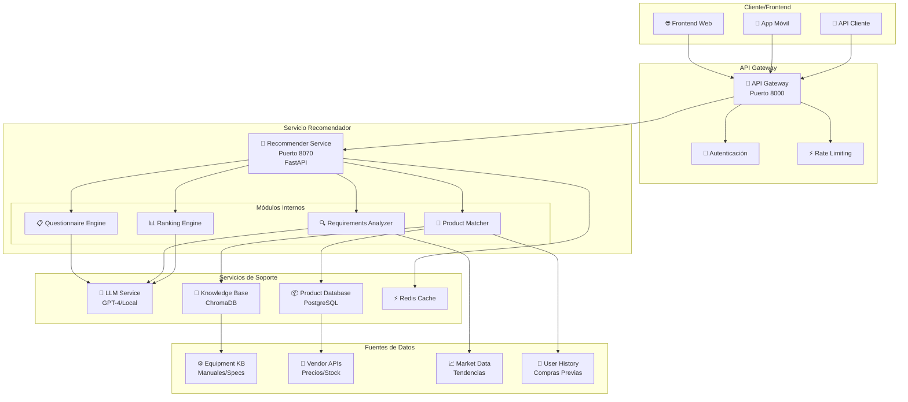
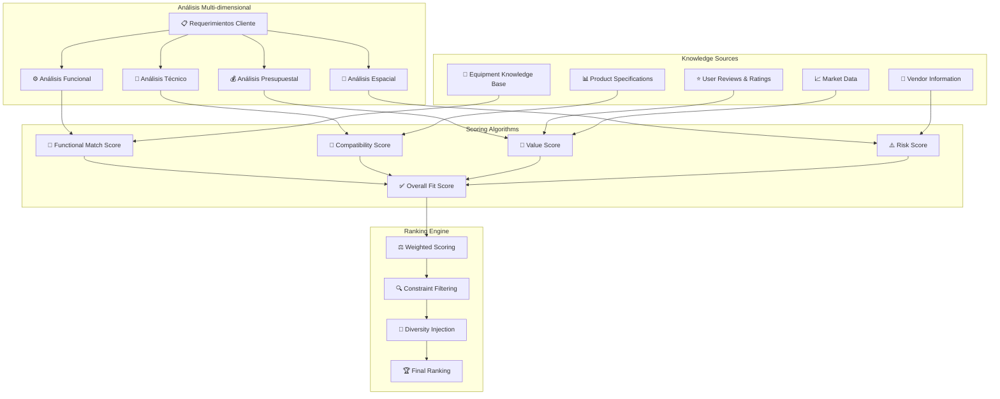
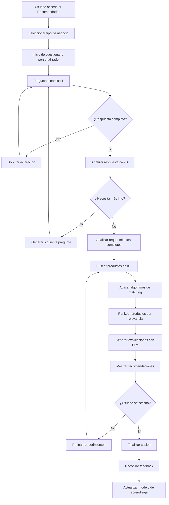
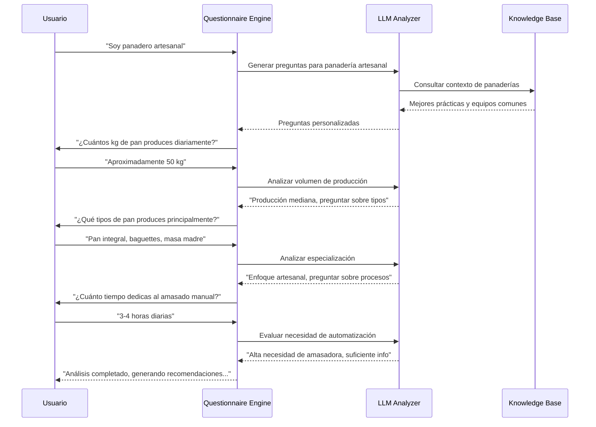

# 🎯 Recommender Service - Servicio de IA Recomendador

## 🎯 **Visión General**

**Recommender Service** es un microservicio de IA especializado que analiza las necesidades específicas de un negocio a través de cuestionarios inteligentes y recomienda equipamientos óptimos basándose en el Knowledge Base existente. El servicio utiliza Large Language Models (LLM) para generar preguntas adaptativas y análisis contextual profundo.

---

## 🏗️ **Arquitectura del Sistema**



## 🎯 **Características Principales**

### **🧠 IA Conversacional Adaptativa**
- ✅ **Cuestionarios dinámicos** generados por LLM según el tipo de negocio
- ✅ **Preguntas adaptativas** que evolucionan según las respuestas
- ✅ **Análisis contextual** profundo de requerimientos
- ✅ **Generación automática** de explicaciones y justificaciones

### **🎯 Motor de Recomendaciones Multi-dimensional**
- ✅ **Scoring avanzado** con múltiples factores de evaluación
- ✅ **Matching funcional** entre requerimientos y productos
- ✅ **Análisis de compatibilidad** técnica y operativa
- ✅ **Optimización presupuestal** y de espacio

### **📊 Especialización por Sectores**
- ✅ **Templates específicos** para cada tipo de negocio
- ✅ **Conocimiento especializado** por industria
- ✅ **Mejores prácticas** y benchmarks del sector
- ✅ **Casos de uso** optimizados por vertical

### **🔄 Aprendizaje Continuo**
- ✅ **Feedback loop** para mejora del modelo
- ✅ **Analytics avanzados** de performance
- ✅ **A/B testing** para optimización
- ✅ **Actualización automática** del conocimiento

---

## 🚀 **Quick Start**

### **1. Configuración**
```bash
# Variables de entorno
RECOMMENDER_SERVICE_PORT=8070
RECOMMENDER_LOG_LEVEL=info

# LLM Configuration
RECOMMENDER_LLM_PROVIDER=openai
RECOMMENDER_LLM_API_KEY=sk-your-openai-key
RECOMMENDER_LLM_MODEL=gpt-4o
RECOMMENDER_LLM_TEMPERATURE=0.1

# Knowledge Base
RECOMMENDER_KB_URL=http://kb-service:7070/tools/kb_search
RECOMMENDER_KB_INGEST_URL=http://kb-service:7070/tools/kb_ingest

# Database
RECOMMENDER_DB_HOST=postgres
RECOMMENDER_DB_PORT=5432
RECOMMENDER_DB_NAME=recommender_db
RECOMMENDER_DB_USER=recommender
RECOMMENDER_DB_PASSWORD=secure_password

# Cache
RECOMMENDER_REDIS_URL=redis://redis:6379/2
```

### **2. Ejecutar Servicio**
```bash
# Docker
docker-compose up -d recommender-service

# Local
cd services/recommender-service
python -m uvicorn main:app --port 8070
```

### **3. Verificar Funcionamiento**
```bash
# Health check
curl http://localhost:8070/health

# Iniciar sesión de recomendación
curl -X POST "http://localhost:8070/api/v1/recommendations/sessions" \
  -H "Content-Type: application/json" \
  -d '{"business_type": "bakery", "user_id": "test_user"}'
```

---

## 📊 **Casos de Uso por Sector**

### **🥖 Panadería Artesanal**
```json
{
  "business_type": "bakery",
  "questionnaire_flow": {
    "initial_questions": [
      "¿Cuántos kg de pan produces diariamente?",
      "¿Qué tipos de pan produces principalmente?",
      "¿Cuál es tu proceso más lento?"
    ],
    "adaptive_logic": {
      "high_volume": "Recomendar equipos industriales",
      "artisan_focus": "Enfocarse en calidad y versatilidad",
      "space_constrained": "Priorizar equipos compactos"
    }
  },
  "typical_recommendations": [
    "Amasadoras espirales para masa madre",
    "Hornos de convección con vapor",
    "Cámaras de fermentación controlada"
  ]
}
```

### **🍕 Pizzería**
```json
{
  "business_type": "pizzeria",
  "questionnaire_flow": {
    "initial_questions": [
      "¿Cuántas pizzas vendes por día?",
      "¿Delivery, dine-in o mixto?",
      "¿Preparas masa fresca diariamente?"
    ],
    "key_factors": [
      "Velocidad de cocción",
      "Capacidad de producción",
      "Calidad del producto final"
    ]
  },
  "equipment_priorities": {
    "high_volume": ["Horno transportador", "Prep tables refrigeradas"],
    "artisan_style": ["Horno de leña", "Amasadora lenta"],
    "delivery_focused": ["Warmers", "Packaging equipment"]
  }
}
```

### **☕ Cafetería**
```json
{
  "business_type": "cafe",
  "questionnaire_flow": {
    "initial_questions": [
      "¿Cuántas tazas de café sirves por día?",
      "¿Ofreces comida además de bebidas?",
      "¿Tuestas tu propio café?"
    ],
    "specialization_paths": {
      "specialty_coffee": "Equipos de alta gama para extracción",
      "high_volume": "Equipos automáticos y eficientes",
      "food_focused": "Equipos de cocina compactos"
    }
  }
}
```

---

## 🔌 **API Reference**

### **🎯 Gestión de Sesiones**

#### **POST /api/v1/recommendations/sessions**
Crear nueva sesión de recomendación

**Request:**
```json
{
  "business_type": "bakery",
  "user_id": "optional_user_id",
  "anonymous_id": "browser_session_id",
  "initial_context": {
    "location": "Mexico City",
    "company_size": "small",
    "budget_range": "medium"
  }
}
```

**Response:**
```json
{
  "session_id": "rec_sess_12345",
  "status": "active",
  "business_type": "bakery",
  "estimated_duration_minutes": 15,
  "progress": {
    "current_step": "questionnaire",
    "completion_percentage": 0
  },
  "next_action": {
    "type": "question",
    "url": "/api/v1/questionnaire/next-question/rec_sess_12345"
  }
}
```

#### **GET /api/v1/recommendations/sessions/:sessionId**
Obtener estado de la sesión

**Response:**
```json
{
  "session_id": "rec_sess_12345",
  "status": "in_progress",
  "progress": {
    "current_step": "analysis",
    "completion_percentage": 75,
    "questions_answered": 8,
    "estimated_time_remaining": 3
  },
  "client_profile": {
    "business_type": "bakery",
    "production_volume_kg": 50,
    "specializations": ["artisan", "sourdough"],
    "constraints": ["limited_space", "medium_budget"]
  }
}
```

### **📋 Motor de Cuestionarios**

#### **GET /api/v1/questionnaire/next-question/:sessionId**
Obtener siguiente pregunta adaptativa

**Response:**
```json
{
  "question": {
    "id": "q_production_volume",
    "type": "numeric_input",
    "category": "production_capacity",
    "text": "¿Cuántos kilogramos de pan produces en un día promedio?",
    "description": "Esta información nos ayuda a determinar el tamaño y capacidad de los equipos que necesitas",
    "input_config": {
      "min_value": 1,
      "max_value": 10000,
      "unit": "kg/día",
      "step": 1
    },
    "validation_rules": [
      {
        "type": "required",
        "message": "Este dato es esencial para las recomendaciones"
      },
      {
        "type": "range",
        "min": 1,
        "max": 10000,
        "message": "El valor debe estar entre 1 y 10,000 kg"
      }
    ],
    "help_text": "Incluye toda la producción: pan, pasteles, productos horneados",
    "examples": [
      "Una panadería pequeña: 20-50 kg/día",
      "Panadería mediana: 100-300 kg/día",
      "Panadería industrial: 500+ kg/día"
    ]
  },
  "progress": {
    "current_question": 3,
    "total_estimated": 12,
    "completion_percentage": 25
  },
  "context": {
    "why_asking": "Necesitamos conocer tu volumen de producción para recomendar equipos con la capacidad adecuada",
    "how_used": "Este dato determina el tamaño de amasadoras, hornos y equipos de preparación"
  }
}
```

#### **POST /api/v1/questionnaire/answer**
Enviar respuesta a pregunta

**Request:**
```json
{
  "session_id": "rec_sess_12345",
  "question_id": "q_production_volume",
  "answer": {
    "type": "numeric_input",
    "value": 75,
    "confidence": "high",
    "additional_notes": "Varía según temporada, en navidad llego a 120 kg"
  }
}
```

**Response:**
```json
{
  "status": "accepted",
  "analysis": {
    "interpreted_value": 75,
    "category": "medium_production",
    "implications": [
      "Requiere amasadora de 25-50 kg de capacidad",
      "Horno de convección doble o triple",
      "Considera equipos semi-industriales"
    ]
  },
  "next_question_preview": {
    "category": "product_specialization",
    "focus": "Tipos de pan que produces"
  },
  "progress_update": {
    "completion_percentage": 33,
    "questions_remaining": 8
  }
}
```

### **🔍 Análisis y Recomendaciones**

#### **POST /api/v1/recommendations/generate**
Generar recomendaciones basadas en análisis

**Request:**
```json
{
  "session_id": "rec_sess_12345",
  "preferences": {
    "max_recommendations": 10,
    "include_alternatives": true,
    "budget_flexibility": "medium",
    "priority_factors": ["functionality", "cost_effectiveness", "reliability"]
  }
}
```

**Response:**
```json
{
  "session_id": "rec_sess_12345",
  "recommendations": [
    {
      "rank": 1,
      "product": {
        "id": "prod_12345",
        "name": "Amasadora Espiral AE-50",
        "brand": "TechBake Pro",
        "category": "mixers",
        "subcategory": "spiral_mixers"
      },
      "scores": {
        "overall_fit": 94,
        "functional_match": 98,
        "technical_compatibility": 91,
        "value_score": 87,
        "user_rating": 4.7
      },
      "reasoning": {
        "primary_reasons": [
          "Capacidad perfecta para tu volumen de 75 kg/día",
          "Ideal para masas de pan artesanal y masa madre",
          "Excelente relación calidad-precio en tu rango presupuestal"
        ],
        "pros": [
          "Motor de alta eficiencia que reduce tiempo de amasado 30%",
          "Bowl de acero inoxidable removible para fácil limpieza",
          "Controles digitales con 12 programas pre-configurados"
        ],
        "cons": [
          "Requiere espacio mínimo de 2x1.5 metros",
          "Inversión inicial alta pero ROI en 18 meses"
        ]
      },
      "business_impact": {
        "productivity_increase": 35,
        "quality_improvement": 25,
        "cost_reduction": 15,
        "roi_months": 18
      },
      "pricing": {
        "base_price": 85000,
        "currency": "MXN",
        "financing_available": true,
        "installation_cost": 5000,
        "maintenance_cost_annual": 3500
      }
    }
  ],
  "analysis_summary": {
    "client_profile": {
      "business_type": "artisan_bakery",
      "production_category": "medium_volume",
      "specialization": "sourdough_specialist",
      "key_constraints": ["space_limited", "quality_focused"]
    },
    "recommendation_strategy": "Priorizar equipos que mejoren calidad y eficiencia sin comprometer el carácter artesanal",
    "total_investment_estimated": 450000,
    "expected_roi": "18-24 meses",
    "implementation_timeline": "2-3 meses"
  }
}
```

#### **GET /api/v1/recommendations/:sessionId/products/:productId**
Obtener análisis detallado de producto específico

**Response:**
```json
{
  "product_analysis": {
    "product_id": "prod_12345",
    "detailed_specs": {
      "capacity": "50 kg masa",
      "power_consumption": "7.5 kW",
      "dimensions": "120x80x140 cm",
      "weight": "450 kg",
      "production_rate": "120 kg/hora"
    },
    "suitability_analysis": {
      "requirement_matches": [
        {
          "requirement": "production_volume",
          "match_percentage": 98,
          "explanation": "Capacidad ideal para 75 kg/día con margen de crecimiento"
        },
        {
          "requirement": "product_quality",
          "match_percentage": 95,
          "explanation": "Amasado lento preserva estructura del gluten para panes artesanales"
        }
      ]
    },
    "implementation_considerations": {
      "installation_requirements": [
        "Piso reforzado (mín. 500 kg/m²)",
        "Toma trifásica 220V",
        "Ventilación adicional recomendada"
      ],
      "training_needed": "2 días de capacitación incluidos",
      "maintenance_schedule": "Mantenimiento preventivo cada 3 meses",
      "warranty": "2 años completos con servicio técnico"
    },
    "alternatives": [
      {
        "product_id": "prod_12346",
        "name": "Amasadora Planetaria AP-60",
        "why_alternative": "Mayor versatilidad para diferentes tipos de masa",
        "trade_offs": "Menor capacidad pero más versátil"
      }
    ]
  }
}
```

### **💡 Feedback y Mejora Continua**

#### **POST /api/v1/feedback/recommendation**
Enviar feedback sobre recomendación

**Request:**
```json
{
  "session_id": "rec_sess_12345",
  "product_id": "prod_12345",
  "feedback_type": "interest_level",
  "rating": 4,
  "comments": "Me interesa mucho, pero necesito más información sobre financiamiento",
  "specific_concerns": [
    "upfront_cost",
    "financing_options",
    "installation_complexity"
  ],
  "likely_to_purchase": "very_likely",
  "timeline": "within_3_months"
}
```

#### **POST /api/v1/analytics/improvement-suggestion**
Sugerir mejoras al servicio

**Request:**
```json
{
  "session_id": "rec_sess_12345",
  "suggestion_type": "questionnaire",
  "description": "Faltó preguntar sobre restricciones de altura en mi local",
  "impact": "high",
  "suggested_question": "¿Cuál es la altura máxima disponible en tu área de producción?"
}
```

---

## 🗄️ **Modelos de Datos**

### **🎯 Sesión de Recomendación**

```typescript
interface RecommendationSession {
  id: string;
  user_id?: string;
  anonymous_id?: string;
  
  // Información del cliente
  client_profile: ClientProfile;
  
  // Progreso del cuestionario
  questionnaire_state: QuestionnaireState;
  
  // Análisis de requerimientos
  requirements: ClientRequirements;
  
  // Resultados
  recommendations: ProductRecommendation[];
  
  // Estado de la sesión
  status: 'active' | 'completed' | 'abandoned';
  current_step: string;
  
  // Metadatos
  created_at: Date;
  updated_at: Date;
  completed_at?: Date;
  session_duration_minutes?: number;
}
```

### **👤 Perfil del Cliente**

```typescript
interface ClientProfile {
  // Información básica
  business_type: BusinessType;
  industry_sector: string;
  company_size: CompanySize;
  location: LocationInfo;
  
  // Información específica del negocio
  business_details: BusinessDetails;
  
  // Contexto operacional
  operational_context: OperationalContext;
  
  // Preferencias
  preferences: ClientPreferences;
}

enum BusinessType {
  BAKERY = 'bakery',
  RESTAURANT = 'restaurant',
  CAFE = 'cafe',
  FOOD_TRUCK = 'food_truck',
  CATERING = 'catering',
  INDUSTRIAL_KITCHEN = 'industrial_kitchen',
  HOTEL = 'hotel',
  SUPERMARKET = 'supermarket',
  OTHER = 'other'
}

interface BusinessDetails {
  // Para panaderías
  daily_bread_production_kg?: number;
  bread_types: BreadType[];
  has_pastry_section?: boolean;
  delivery_service?: boolean;
  retail_vs_wholesale_ratio?: number;
  
  // Para restaurantes
  cuisine_type?: CuisineType[];
  service_style?: ServiceStyle[];
  covers_per_day?: number;
  kitchen_space_m2?: number;
  
  // Información general
  operating_hours: OperatingHours;
  peak_seasons: string[];
  special_requirements: string[];
}
```

### **📋 Motor de Cuestionarios**

```typescript
interface Question {
  id: string;
  type: QuestionType;
  category: QuestionCategory;
  text: string;
  description?: string;
  
  // Configuración de la pregunta
  is_required: boolean;
  depends_on: QuestionDependency[];
  validation_rules: ValidationRule[];
  
  // Opciones de respuesta
  answer_options?: AnswerOption[];
  input_config?: InputConfig;
  
  // Metadatos
  priority: number;
  estimated_time_seconds: number;
  help_text?: string;
  examples?: string[];
}

enum QuestionType {
  SINGLE_CHOICE = 'single_choice',
  MULTIPLE_CHOICE = 'multiple_choice',
  NUMERIC_INPUT = 'numeric_input',
  TEXT_INPUT = 'text_input',
  RANGE_SLIDER = 'range_slider',
  RATING = 'rating',
  YES_NO = 'yes_no',
  FILE_UPLOAD = 'file_upload',
  LOCATION_PICKER = 'location_picker'
}
```

### **🎯 Recomendaciones de Productos**

```typescript
interface ProductRecommendation {
  id: string;
  session_id: string;
  
  // Información del producto
  product: Product;
  
  // Puntuación y ranking
  relevance_score: number; // 0-100
  confidence_score: number; // 0-100
  overall_rank: number;
  
  // Análisis de ajuste
  requirement_match: RequirementMatch[];
  pros: RecommendationPoint[];
  cons: RecommendationPoint[];
  
  // Información comercial
  pricing: PricingInfo;
  availability: AvailabilityInfo;
  alternatives: AlternativeProduct[];
  
  // Justificación de la recomendación
  recommendation_reasoning: RecommendationReasoning;
  
  // Metadatos
  recommended_at: Date;
  recommendation_source: 'ai_analysis' | 'rule_based' | 'collaborative_filtering' | 'content_based';
}

interface RecommendationReasoning {
  primary_reasons: string[];
  requirement_satisfaction: RequirementSatisfaction;
  business_impact: BusinessImpact;
  risk_assessment: RiskAssessment;
  roi_analysis: ROIAnalysis;
  implementation_considerations: ImplementationConsideration[];
}
```

---

## 🧠 **Algoritmos de Recomendación**

### **🎯 Motor de Matching Multi-dimensional**



### **🤖 Integración con LLM**

```typescript
interface LLMAnalysisConfig {
  // Configuración del modelo
  model: 'gpt-4o' | 'gpt-4-turbo' | 'claude-3' | 'local-llama';
  temperature: number;
  max_tokens: number;
  
  // Prompts especializados
  prompts: {
    questionnaire_generation: string;
    requirement_analysis: string;
    product_matching: string;
    reasoning_generation: string;
  };
  
  // Configuración de contexto
  context_windows: {
    business_context: string[];
    technical_context: string[];
    market_context: string[];
  };
}
```

---

## 🔄 **Flujos de Usuario Principales**

### **📱 Flujo Principal de Recomendación**



### **🔄 Flujo de Cuestionario Adaptativo**



---

## 📊 **Configuración por Sectores**

### **🥖 Panadería Artesanal**

```json
{
  "business_type": "bakery",
  "questionnaire_template": {
    "initial_questions": [
      {
        "id": "production_volume",
        "text": "¿Cuántos kilogramos de pan produces diariamente?",
        "type": "numeric_input",
        "validation": { "min": 1, "max": 10000, "unit": "kg" },
        "context": "Determinar escala de operación"
      },
      {
        "id": "bread_types",
        "text": "¿Qué tipos de pan produces principalmente?",
        "type": "multiple_choice",
        "options": ["Pan blanco", "Integral", "Artesanal", "Baguette", "Masa madre", "Sin gluten"],
        "context": "Identificar especialización y equipos necesarios"
      }
    ],
    "adaptive_questions": {
      "high_volume_production": [
        {
          "condition": { "production_volume": { "gte": 100 } },
          "question": {
            "text": "¿Tienes problemas de capacidad en horas pico?",
            "type": "yes_no",
            "follow_up": "¿En qué momentos específicos?"
          }
        }
      ],
      "artisan_focus": [
        {
          "condition": { "bread_types": { "includes": ["Artesanal", "Masa madre"] } },
          "question": {
            "text": "¿Cuánto tiempo dedicas diariamente al desarrollo de masas madre?",
            "type": "numeric_input",
            "unit": "horas"
          }
        }
      ]
    }
  },
  "equipment_categories": [
    {
      "category": "mixers",
      "priority": "high",
      "subcategories": ["spiral_mixers", "planetary_mixers"],
      "selection_criteria": ["production_volume", "bread_types", "space_constraints"]
    },
    {
      "category": "ovens",
      "priority": "critical",
      "subcategories": ["deck_ovens", "convection_ovens", "steam_injection"],
      "selection_criteria": ["production_volume", "product_types", "quality_requirements"]
    }
  ],
  "success_metrics": [
    {
      "metric": "production_efficiency",
      "target_improvement": 30,
      "measurement": "kg_per_hour"
    },
    {
      "metric": "product_quality",
      "target_improvement": 20,
      "measurement": "customer_satisfaction"
    }
  ]
}
```

### **🍕 Pizzería**

```json
{
  "business_type": "pizzeria",
  "questionnaire_template": {
    "initial_questions": [
      {
        "id": "service_model",
        "text": "¿Cuál es tu modelo de servicio principal?",
        "type": "single_choice",
        "options": ["Dine-in", "Delivery", "Takeout", "Mixto"],
        "context": "Determinar flujo operativo y equipos necesarios"
      },
      {
        "id": "pizzas_per_day",
        "text": "¿Cuántas pizzas vendes en un día promedio?",
        "type": "numeric_input",
        "validation": { "min": 10, "max": 2000, "unit": "pizzas" },
        "context": "Calcular capacidad requerida de horno"
      }
    ]
  },
  "equipment_matching": {
    "ovens": {
      "low_volume": { "max_pizzas": 50, "recommendation": "conveyor_oven_small" },
      "medium_volume": { "max_pizzas": 200, "recommendation": "deck_oven_double" },
      "high_volume": { "max_pizzas": 500, "recommendation": "conveyor_oven_industrial" }
    }
  }
}
```

---

## 📈 **Métricas y Analytics**

### **📊 KPIs del Servicio**

```typescript
interface RecommenderMetrics {
  // Métricas de sesión
  session_metrics: {
    total_sessions: number;
    completed_sessions: number;
    abandonment_rate: number;
    average_duration_minutes: number;
    completion_rate_by_business_type: Record<BusinessType, number>;
  };
  
  // Métricas de cuestionario
  questionnaire_metrics: {
    average_questions_asked: number;
    question_effectiveness: QuestionEffectiveness[];
    user_satisfaction_scores: number[];
    skip_rates_by_question: Record<string, number>;
  };
  
  // Métricas de recomendación
  recommendation_metrics: {
    average_recommendations_per_session: number;
    click_through_rates: number[];
    user_interest_scores: number[];
    purchase_conversion_rate: number;
    recommendation_accuracy: number;
  };
  
  // Métricas de negocio
  business_metrics: {
    lead_generation_rate: number;
    qualified_leads: number;
    average_deal_size: number;
    customer_acquisition_cost: number;
    lifetime_value: number;
  };
}
```

---

## 🚀 **Roadmap de Implementación**

### **Fase 1: Core Engine (4-6 semanas)**
- [ ] **Servicio base** FastAPI con endpoints básicos
- [ ] **Motor de cuestionarios** con preguntas estáticas
- [ ] **Integración básica LLM** para análisis
- [ ] **Base de datos** PostgreSQL con modelos
- [ ] **Integración KB** para búsqueda de productos

### **Fase 2: IA Avanzada (4-5 semanas)**
- [ ] **Cuestionarios adaptativos** con LLM
- [ ] **Algoritmos de matching** multi-dimensional
- [ ] **Motor de ranking** con múltiples factores
- [ ] **Análisis de requerimientos** inteligente
- [ ] **Generación de explicaciones** automática

### **Fase 3: Especialización por Sector (3-4 semanas)**
- [ ] **Templates específicos** por tipo de negocio
- [ ] **Conocimiento especializado** por industria
- [ ] **Flujos optimizados** para cada sector
- [ ] **Métricas específicas** por vertical
- [ ] **Validación con expertos** del dominio

### **Fase 4: Optimización y Analytics (2-3 semanas)**
- [ ] **Sistema de feedback** y aprendizaje
- [ ] **Analytics y métricas** comprehensivas
- [ ] **A/B testing** framework
- [ ] **Performance optimization**
- [ ] **Documentation completa**

---

## 🔧 **Variables de Entorno**

```bash
# ==================== RECOMMENDER SERVICE CONFIGURATION ====================

# Servicio
RECOMMENDER_SERVICE_PORT=8070
RECOMMENDER_SERVICE_NAME=recommender-service
RECOMMENDER_LOG_LEVEL=info
RECOMMENDER_DEBUG_MODE=false

# LLM Configuration
RECOMMENDER_LLM_PROVIDER=openai
RECOMMENDER_LLM_API_KEY=sk-your-openai-api-key
RECOMMENDER_LLM_MODEL=gpt-4o
RECOMMENDER_LLM_TEMPERATURE=0.1
RECOMMENDER_LLM_MAX_TOKENS=2000

# Knowledge Base Integration
RECOMMENDER_KB_URL=http://kb-service:7070/tools/kb_search
RECOMMENDER_KB_INGEST_URL=http://kb-service:7070/tools/kb_ingest
RECOMMENDER_KB_AUTH_TOKEN=optional-bearer-token

# Database
RECOMMENDER_DB_HOST=postgres
RECOMMENDER_DB_PORT=5432
RECOMMENDER_DB_NAME=recommender_db
RECOMMENDER_DB_USER=recommender
RECOMMENDER_DB_PASSWORD=secure_password

# Cache
RECOMMENDER_REDIS_URL=redis://redis:6379/2
RECOMMENDER_CACHE_TTL_SECONDS=3600

# Recommendation Engine
RECOMMENDER_MAX_RECOMMENDATIONS=10
RECOMMENDER_DIVERSITY_THRESHOLD=0.3
RECOMMENDER_MIN_CONFIDENCE_SCORE=0.7

# Analytics
RECOMMENDER_ANALYTICS_ENABLED=true
RECOMMENDER_FEEDBACK_COLLECTION=true
RECOMMENDER_A_B_TESTING=true

# External Integrations
RECOMMENDER_VENDOR_APIS_ENABLED=true
RECOMMENDER_MARKET_DATA_ENABLED=true
RECOMMENDER_PRICING_UPDATES_ENABLED=true
```

---

## 📚 **Documentación Adicional**

- [API Reference Completa](./docs/api-reference.md)
- [Algoritmos de Recomendación](./docs/recommendation-algorithms.md)
- [Configuración por Sectores](./docs/business-type-configs.md)
- [Integración con LLM](./docs/llm-integration.md)
- [Analytics y Métricas](./docs/analytics.md)
- [Guía de Deployment](./docs/deployment.md)
- [Troubleshooting](./docs/troubleshooting.md)

---

**¡Recommender Service: El futuro de las recomendaciones inteligentes para equipamientos industriales!** 🎯🤖🚀


